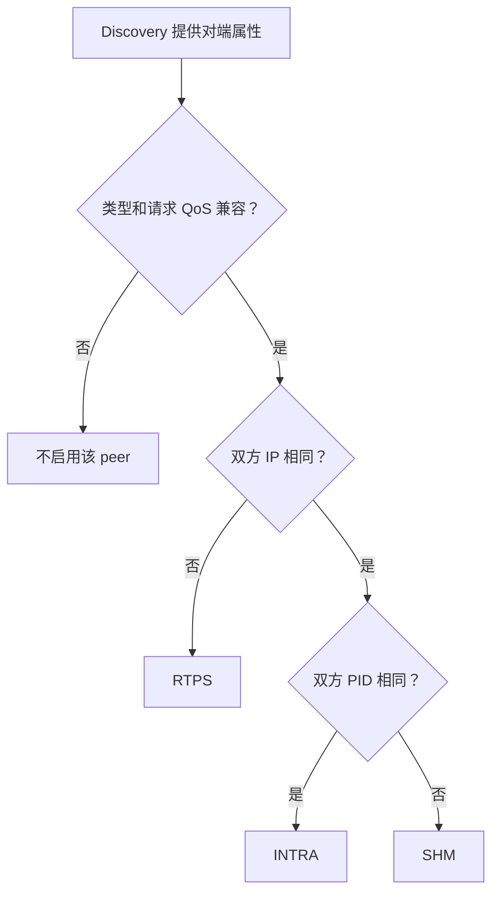

# MINI CyberRT

基于 cmw 二次开发的 C++ 发布订阅通信中间件，面向 Linux。主要能力是 Discovery 自动发现、
INTRA/SHM/RTPS 自动选路、SHM Loan/View，以及配套的生命周期保护和回归测试。

## 快速开始

准备 Linux、g++、make 和 Fast DDS，在仓库根目录运行：

```bash
./example/demo/run_demo.sh
```

脚本构建并演示 A～E，约 3 分钟（首次编译另计）。出现 `[RESULT] PASS requested=all` 表示全部场景通过。
需要 `unshare` 支持；依赖见 [环境检查](doc/fastrtps.md)，单场景和双终端操作见 [Demo 指南](example/demo/README.md)。

普通编译产物统一放在 `example/build/`，不同配置使用子目录；通信 Demo 使用 `example/demo/build/`。
构建入口拒绝其他 `BUILD_DIR`，运行日志统一写入根目录 `log/`。

## 文档导航

| 想了解什么 | 入口 |
| --- | --- |
| 模块关系与消息流程 | [总体架构](doc/architecture.md) → [通信流程](doc/transport.md) → [Discovery](doc/topology.md) |
| 定义消息、配置运行时 | [消息与序列化](doc/serialize.md)、[配置说明](config/config.md) |
| 回调如何执行 | [调度器](doc/scheduler.md)、[协程](doc/croutine.md)、[基础组件](base/base.md) |
| 运行测试、sanitizer 或 benchmark | [测试指南](example/TESTING.md) |
| 查实际命令、失败与复验 | [测试日志](example/testlog.md) |
| 准备展示与实习面试 | [通信 Demo](example/demo/README.md)、[项目评审](doc/review-20260914.md) |
| 维护文档与产物目录 | [AGENTS.md](AGENTS.md) |

## 功能与使用边界

### Discovery 驱动的混合传输

Node 的 Publisher/Subscriber 默认使用 HYBRID，对每个已发现的 peer 按以下流程选择后端：



图中一次判断对应一个 peer；一个 Publisher 面向多个 peer 时可以同时启用多种后端。
三条路径的数据处理方式如下，完整创建与收发时序见 [总体架构](doc/architecture.md)。

| 对端位置 | 路径 | 数据传递方式 |
| --- | --- | --- |
| 相同 IP、相同 PID | INTRA | 共享消息 `shared_ptr`，不序列化 |
| 相同 IP、不同 PID | SHM | 本项目的共享内存和通知区 |
| 不同 IP | RTPS | Fast DDS 的 RTPS 接口 |

每种活跃模式只发送一次，多位置订阅者可使多条路径同时活跃。重复 JOIN 幂等；最后一个同模式
订阅者离开时关闭对应发送后端，后续 JOIN 可重新启用。接收端的频道 Receiver/Dispatcher 可继续缓存复用。

普通 Publish 没有订阅者时仍可返回 true；Loan 没有路由时 Acquire/Publish 失败。
不提供自动 fallback、失败重试或离线补发。多路径发送可能部分成功，整体返回 false 时不回滚已投递消息。
低层 `Transport::CreateTransmitter/CreateReceiver` 可显式选后端；Node 没有模式参数。

### 消息类型与初始化失败

Node 和直接 Publisher/Subscriber 模板入口自动填充消息类型。推荐用 `MessageTypeTrait<T>` 声明
非空名称与正整数版本，生成 `cmw.schema/名称@版本`；只设置其中一项会被拒绝。
完整例子见 [定义消息](doc/serialize.md)。

未特化 trait 时，保留调用者显式提供的标识，否则使用带编译器版本的 C++ 类型签名。
该回退只能辅助检查同构构建，不能检测同名结构体字段变化，也不提供可移植 schema 或版本转换。

Discovery 在 JOIN 入表前检查同频道类型；空类型或不匹配类型不入表、不通知业务、不广播。
HYBRID 启用 peer 时再次检查。本地冲突使工厂返回空指针，接收器缓存保留期间也不能切换频道类型。
旧程序的空类型公告不再接纳；显式低层 RTPS 使用固定 underlay 类型，直接调用者仍须保证语义类型一致。

Discovery 不可用时 `CreateNode()` 返回空指针；Participant/Reader/Writer 中途创建失败会回收已建资源。
修复环境后可显式调用 `TopologyManager::Init()` 重试。正常使用前应检查所有工厂返回值。

<a id="discovery-拓扑通知容量"></a>
<a id="discovery-后启动进程发现"></a>

### Discovery 发现与关闭

Discovery 的 RTPS 端点与端点公告均使用 `RELIABLE + TRANSIENT_LOCAL`，业务 QoS 独立配置。
全新订阅进程可从保留的拓扑历史发现仍在线的发布者，无需应用重新公告；这不包含离线业务消息补发。
每个 Subscriber 有唯一 endpoint id，创建时查询已有 Writer；Publisher 同样查询已有 Reader。
Reader LEAVE 同时删除按节点和按频道维护的索引。

拓扑通知按实际序列化长度分配，支持超过 255 字节的元数据。长度超过 32 位或分配、容量、History
提交失败时返回 false，并释放未提交 change；已更新的本地拓扑不回滚。保留历史默认最多 1000 条，
容量耗尽后不提供全量状态重建。

显式关闭先停止并排空 Discovery 回调，再关闭端点、Participant，最后释放 listener；重复关闭安全。
生命周期切换由回调之外的控制线程发起；重建前先停止业务并释放原 Node/端点。
不支持与活跃业务任意交错，详见下方 [并发边界](#发送端生命周期与并发边界)。

### QoS 配置与执行边界

业务默认值为 `KEEP_LAST / depth=1 / RELIABLE / VOLATILE / max_samples=1000 / mps=0 / msg_size=0`。
晚加入者只接收匹配后的新消息；一次性初始化信息需要应用提供查询或周期同步。
仅保留 `QOS_PROFILE_DEFAULT`、`QOS_PROFILE_TOPO_CHANGE` 两个预设；旧场景预设和工厂迁移为构造 `QosProfile` 后赋值。

`NormalizeQosProfile` 将 `SYSTEM_DEFAULT` 解析为项目默认值，传输 `depth=0` 解析为 1。
非法枚举、零或溢出的 `max_samples`、超上限的 KEEP_LAST depth、会使 RTPS 缓冲溢出的 `msg_size` 均拒绝。
Node/Transport 工厂返回空指针，直接构造底层 Endpoint 派生类时抛出 `std::invalid_argument`。

本项目通过低层 `QosWriterHistory/QosReaderHistory` 执行策略：

| 策略 | Writer | Reader |
| --- | --- | --- |
| KEEP_LAST | 最多保留 depth 条；替换最旧样本后，该样本也不能再重传或回放 | 最多保留 depth 条待交付样本，满时淘汰最旧项 |
| KEEP_ALL | 最多 max_samples 条；满时仅 VOLATILE 可回收已完成投递的最旧样本，否则发送失败 | 最多 max_samples 条；满时拒收，RELIABLE 可在空间释放后重传 |

Listener 复制 Payload 和元数据后即消费 ReaderHistory，再向下游分发。VOLATILE 仍有可靠重传所需的历史窗口。
TRANSIENT_LOCAL 保留已确认样本供晚加入者回放；其 KEEP_ALL 满后不会因 ACK 腾出空间，需结束该 Writer 生命周期再重建。
显式 `BEST_EFFORT`、`TRANSIENT_LOCAL` 受支持，但业务历史回放仅由显式 RTPS 后端提供。

Subscriber 的三个容量相互独立：

| 字段 | 默认及零值 | 用途 |
| --- | --- | --- |
| `qos_profile.depth` | 默认 1；0 解析为 1；KEEP_ALL 忽略 | RTPS 传输历史 |
| `pending_queue_size` | 默认 1；0 或超过 int32_t 范围拒绝 | 回调待处理队列；落后越过缓存时跳到最新消息 |
| `history_depth` | 默认 1；0 禁用 | Blocker 观察缓存；`SetHistoryDepth()` 只改此项 |

直接构造 Subscriber 的第四个参数是观察深度；旧代码若用 QoS depth 控制观察缓存，应改用 `history_depth`。
同类型、同频道的 Node Subscriber 共享 Receiver，RTPS Reader 也按频道共享；归一化后的完整传输 QoS 必须相同，
观察深度和待处理队列可不同。接收器缓存保留期间，即使 Subscriber 已退出，也不能换用不同类型或传输 QoS。
HYBRID 还检查 Writer 的可靠性、持久性是否满足 Reader 请求，不满足则不启用该 peer。

`mps` 是可靠 RTPS Writer 的心跳提示，不是限速：0 沿用 Fast DDS 默认，非零夹在 64～1024，周期为 `256 / mps` 秒。
`msg_size` 是 Loan 容量约束和 RTPS 预分配提示，不是普通序列化消息的统一硬上限。

**可靠性边界：** INTRA 的调度缓存、SHM 的块与通知都可能丢弃；SHM 没有可靠重传。
RTPS 只在保留历史窗口内重传/回放。HYBRID 按实际后端提供能力，无 peer 时不缓存消息。
发送成功不代表用户回调已处理。[针对性回归](example/TESTING.md#qos-回归)。

**元数据升级：** `QosProfile` 在原六字段后追加 `max_samples`，互通进程必须一起重建，不能混用旧二进制。
这项元数据变更不改变应用 Payload 格式；SHM 的独立版本要求见 [共享区兼容性](#共享区布局-v3-与兼容性)。

### LoanedMessage 零拷贝

发送顺序：`AcquireMessage(capacity)` → 写 `mutable_data()` → `set_size()` → `Publish(std::move(message))`。
接收端获得只读 View，通过 `data()` 访问。

| 拓扑 | 存储与复制 |
| --- | --- |
| 仅 SHM 活跃 | 借出并提交原 SHM Block，省去中间 Payload 序列化和复制 |
| 含 INTRA 或 RTPS | 使用 heap；INTRA 共享引用，SHM 复制入 Block，RTPS 编码长度与字节 |
| 借出 SHM 后拓扑改变 | 必要时复制 heap 快照；提交 SHM 仍检查 owner/channel/epoch |

SHM View 通过读 Lease 保持映射，最后一个引用释放后归还；引用失效后不能继续使用裸指针。
SHM 后端重启后须重新 Acquire，旧 SHM Loan 不能提交；heap Loan 不受 SHM epoch 限制。
单消息 Subscriber 协程在回调后、Yield 前释放自身引用，用户保存的引用由用户管理。
[拷贝范围说明](example/demo/README.md#loanview-到底省了哪次拷贝)。

### 发送端生命周期与并发边界

支持**一个发布线程**与 Discovery Enable/Disable 并发，包括 INTRA 在该发布线程内同步重入。
每次发送使用独立 MessageInfo；`seq_num_` 不支持多个发布线程并发写。

| 后端 | 同步和关闭 |
| --- | --- |
| INTRA | 锁内检查状态，回调前解锁；已接纳回调可在 Disable 返回后完成 |
| RTPS | 生命周期锁覆盖资源检查与发送；Disable 等待使用结束，再删 Writer/History |
| SHM | 生命周期锁保护资源；Lease 保持映射；持有 Loan 不阻塞 Disable |
| HYBRID | 锁内取路由快照，解锁后发送；拓扑更新遵循路由锁 → 后端锁 |

Publisher Init/Shutdown、析构及全局 Transport/Participant Shutdown 须在发布和拓扑回调停止后执行。
Signal Disconnect 不是回调完成屏障，捕获对象须保持存活；不支持从底层 RTPS listener 直接重入 Fast DDS API。
Node 用户回调由调度器执行。

### 队列与线程调度同步

`BoundedQueue` 是预分配、互斥锁保护的有界 MPMC；槽位操作与索引推进处于同一临界区，不承诺无锁吞吐。
等待代次和条件变量谓词避免丢唤醒。`BreakAllWait()` 终止等待并拒绝入队，普通 Dequeue 仍可取剩余元素；
初始化、更换等待策略须在无并发访问时执行。ThreadPool/TaskManager 满队列或停止后返回无效 future，使用前检查 `valid()`。

协程状态与停止标志使用原子同步，READY 切入 DATA_WAIT 前的通知也会保留；Remove 等待执行者让出。
`range` 绑定整个 CPU 集，`1to1` 按索引绑定其中一项；校验配置、实际 affinity 和系统调用返回值。
FIFO/RR 使用配置优先级；`SetInnerThreadAttr(name, thread, tid)` 返回 bool，SCHED_OTHER 需要目标 Linux tid。
SchedulerClassic 资源配置失败会抛异常。策略与 nice 分两次设置，后者失败可能已改变策略；不提供硬实时保证。
[调度用法](doc/scheduler.md)与[基础组件](base/base.md)。

### 序列化安全

`DataStream` 检查类型、长度和剩余字节，非法输入返回失败，不错误推进读位置；基础类型通过 `memcpy` 避免未对齐访问。
`vector<T>` 按元素编码，`SERIALIZE(...)` 的字段顺序须一致。普通 RTPS 两个适配器均拒绝空指针和解码失败，
不向业务交付部分对象；保留解码对象之后可有额外字节的行为。[消息定义与编码规则](doc/serialize.md)。

<a id="shm-健壮性"></a>
<a id="共享区布局-v2-与兼容性"></a>

### 共享区布局 v3 与兼容性

默认使用 POSIX SHM，XSI 保留用于独立测试；消息上限 **32 MiB**。块占用时最多扫描一轮，超限或无可用块即失败；
重建后再次检查容量，读取时校验块与 generation。MessageInfo 用 `memcpy` 编解码序号，避免未对齐访问。

State、Block、ReadableInfo、Indicator 不含进程私有虚表指针。打开前校验段长、版本、ABI、容量和 Payload 边界；
不兼容时不修改引用或删除旧段。Payload 为 **v3**，与 Notifier 版本独立；不支持在线迁移、跨 ABI 或并发截断映射。

v3 创建者持初始引用，打开者通过 CAS 获取存活引用；最后一个持有者把 1 封闭为 closing，只有成功者可删除段名。
已 mmap 但未获取引用的打开者不能复活 closing 段，须释放映射并在后续操作重新打开；这不提供崩溃后的引用回收。
对象尺寸虽未变，v2 引用协议仍不兼容。升级前停止相关进程并整体重建，确认确切段名/key 后再处理旧段，
不要全局清空 `/dev/shm` 或批量 `ipcrm`。[测试与清理](example/TESTING.md#环境与清理)。

### Notifier 槽位保护与丢弃策略

ConditionNotifier 使用 4096 槽位广播环，发布短锁与槽位互斥保护通知；锁不覆盖 Payload 读取或业务回调。
面向同 ABI 的 Linux 进程，要求 32/64 位原子操作始终 lock-free。

| 情况 | 行为 |
| --- | --- |
| 写者未取得发布锁或槽位锁 | Notify 返回 false，不推进序号，不内部重试 |
| 通知发布成功 | 不保证读者收到，也不保证 Payload 仍可读 |
| 慢读者落后超过一圈 | 跳过被覆盖部分，从仍保留的最早通知继续 |
| 读者遇到忙槽位 | 在 steady-clock 截止前重试；超时不改输出参数 |
| 新接收实例加入 | 从当前发布位置开始，不回放旧通知 |

非正 Listen 超时只尝试一次；空参数、关闭或初始化失败返回 false，序号耗尽拒绝发布。
单实例只支持一个 Listen 调用者，可有多个 Notify 调用者；Shutdown/析构前须结束所有调用。
Notifier **v1** 打开时检查布局，最多等待创建者发布 magic 100 ms；不兼容或未就绪时失败，不改写或删除原区。
失败实例须销毁重建才能重试；持锁进程崩溃不能自动恢复。[对应回归](example/TESTING.md#notifier-槽位保护回归)。

<a id="面试通信-demo"></a>

### 验证与展示范围

Demo A～E 展示 INTRA、自动 SHM、Loan/View、正常退出恢复与同机强制 RTPS；路径诊断仅在 Demo 构建中启用。
当前测试基于 Linux x86-64，没有真实双机、ARM 板端或驱动验证；Component/DAG、choreography 和统一宿主生命周期尚未完整接通。

<a id="shm-性能比较边界"></a>

独立 SHM benchmark 比较普通序列化与 SHM-backed Loan，不经过 HYBRID；使用固定 32 槽×8 MiB 夹具，
分别测量 4 KiB、64 KiB、1 MiB、4 MiB 消息。实验包含生成、传输与全量校验，区分预热、测量和排空；
结果不是纯传输带宽、无损容量或延迟保证。[测量口径](example/TESTING.md#性能程序)与[历史结果](example/testlog.md#2026-09-11-独立进程-shm-性能实验)。

### 统一日志目录

`Init()`、`Logger_Init()`、`Logger::open()` 将日志写入根目录 `log/`。调用者传文件名即可：路径只取末尾名称，
自动补 `.log`；重复打开追加，轮转留在同一目录。根目录优先取 `CMW_PATH`，未设时使用编译时 `CMW_PROJECT_ROOT`；
配置读取仍应显式设置 `CMW_PATH`。定位、建目录或打开失败时明确失败，不回退当前目录。
`log/` 含源码，不可整体删除或忽略；`make clean` 保留日志。Demo 的额外归档见 [Demo 日志说明](example/demo/README.md#6-失败排查与清理)。

## 项目来源

[原作者视频](https://space.bilibili.com/281708692/lists/5849251?type=season) · [原作者讲解文档](https://ai.feishu.cn/drive/folder/PiqFfxWx5l9Ri2dds9WcI3ognCd?from=from_copylink)
