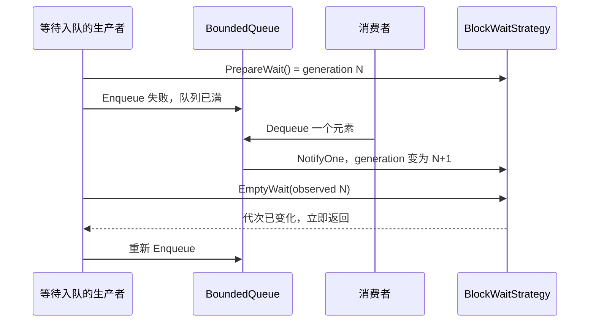

# 基础组件导航

`base/` 提供通信和调度复用的进程内组件。业务代码通常从 Node API 开始，只有实现基础设施时才需要
直接使用这些类型。

| 组件 | 文件 | 关键边界 |
| --- | --- | --- |
| Signal | [signal.h](signal.h) | 解锁后调用槽；Disconnect 不是回调完成屏障 |
| 原子读写锁 | [atomic_rw_lock.h](atomic_rw_lock.h)、[rw_lock_guard.h](rw_lock_guard.h) | 进程内状态保护 |
| 有界队列 | [bounded_queue.h](bounded_queue.h) | 固定容量、mutex 保护的 MPMC 队列 |
| 无界队列 | [unbounded_queue.h](unbounded_queue.h) | 动态增长的任务或事件队列 |
| 等待策略 | [wait_strategy.h](wait_strategy.h) | sleep、yield、busy-spin、阻塞和超时阻塞 |
| 对象池 | [object_pool.h](object_pool.h)、[concurrent_object_pool.h](concurrent_object_pool.h) | 复用对象；耗尽行为由调用者处理 |
| 哈希映射 | [atmoic_hash_map.h](atmoic_hash_map.h) | 注册表和分发索引；文件名保留现有拼写 |
| 线程池 | [thread_pool.h](thread_pool.h) | 有界任务提交与工作线程 |

## Signal

```cpp
hnu::cmw::base::Signal<int> changed;
int latest = 0;
auto connection = changed.Connect([&latest](int value) { latest = value; });
changed(42);
changed.Disconnect(connection);
```

触发时 Signal 复制槽列表，解锁后执行回调。Disconnect 只阻止后续查找到该连接，不等待已经开始的
回调；被捕获对象必须保持存活。Connection 析构也不能代替显式的关闭顺序。

## BoundedQueue 和等待策略

`BoundedQueue<T>` 在 `Init(capacity, strategy)` 时一次性创建固定槽位，之后用一个 mutex 保护索引、
计数和 `T` 的移动/赋值。它支持多生产者、多消费者以及非平凡对象，但不是无锁队列；`T` 需要可默认
构造并可赋值。容量为 0、重复 Init 或空策略会失败。

```cpp
hnu::cmw::base::BoundedQueue<std::string> queue;
if (!queue.Init(64, new hnu::cmw::base::BlockWaitStrategy())) {
  return;
}
queue.WaitEnqueue("work");

std::string value;
if (queue.WaitDequeue(&value)) {
  // use value
}
queue.BreakAllWait();
```

| 操作 | 结果 |
| --- | --- |
| `Enqueue` | 满、未初始化或 BreakAllWait 后返回 false，不再接收新项 |
| `Dequeue` | 空、未初始化或输出指针为空时返回 false；BreakAllWait 后仍可排空已有项 |
| `WaitEnqueue` / `WaitDequeue` | 按策略重试；超时或 BreakAllWait 后停止重试并返回 false |
| `BreakAllWait` | 终止当前和后续等待，析构前用于唤醒阻塞线程；不会清空已有项 |
| `SetWaitStrategy` | 仅能在没有并发队列操作时替换；队列取得所有权 |

下面展示 BlockWaitStrategy 中最容易出错的交错：通知先于等待调用发生，代次谓词仍会让生产者立即
重试，不会睡过这次空间变化。



Block 和 TimeoutBlock 策略先取得通知代次，再进入条件变量谓词。入队或出队会推进代次并唤醒等待者，
从而覆盖“检查条件到休眠”之间的通知，也不会把无等待者时的通知积累成可消费 token。一个队列共用
生产者和消费者等待策略，所以阻塞实现会唤醒全部等待者，由队列条件决定谁能继续。默认策略是每
10 ms 重试的 Sleep；BusySpin 会持续占用 CPU，应只用于经过测量的短等待。

只有 Block 和 TimeoutBlock 会被 `NotifyOne()` 立即唤醒；Sleep 固定睡满当前间隔后重试，Yield 和
BusySpin 则主动轮询。`BreakAllWait()` 会唤醒阻塞等待并使 Wait 操作失败，但普通 `Dequeue()` 仍可
继续取出停止前已经入队的元素。

`Head()`、`Tail()`、`Commit()` 保留为诊断计数，各次读取不是一个原子快照，不能替代 Enqueue/
Dequeue 的返回值来做容量控制。

## ThreadPool 和对象池

ThreadPool 使用 BoundedQueue。`Enqueue()` 在队列已满或线程池停止后返回无效 `future`，调用方必须先
检查 `future.valid()`；析构会停止接收、唤醒工作线程并 join。满队列不会静默假装任务已经接纳。

对象池用于减少分配次数，不提供无限容量。获取失败时应回退、丢弃或上报，具体策略由调用者决定。
裸指针元素的生命周期也由调用者管理。这些组件只用于进程内存，不能直接放入 SHM 充当跨进程同步
结构；带缓存行对齐的对象仍需项目 C++14 构建使用的 `-faligned-new`。

实际调用可从[拓扑](../doc/topology.md)、[传输](../doc/transport.md)和[协程](../doc/croutine.md)继续阅读。
构建与验证入口统一见[测试指南](../example/TESTING.md)。
