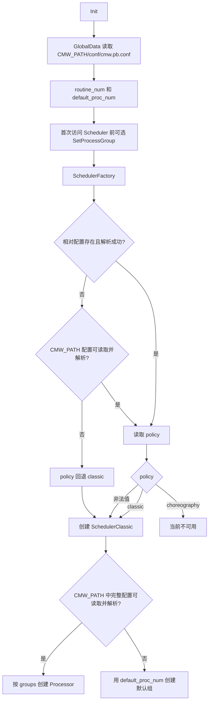

# 配置怎么使用

手工启动程序前设置项目根目录：

```bash
export CMW_PATH="$PWD"
```

运行库据此查找 `conf/` 并定位日志目录；Demo 脚本会自动设置。

## 配置入口

| 配置 | 用途 | 读取入口 |
| --- | --- | --- |
| [cmw.pb.conf](../conf/cmw.pb.conf) | 协程池预分配量、默认 Processor 数 | [GlobalData::InitConfig](../common/global_data.cpp) |
| `conf/<进程组>.conf` | classic 分组、任务、绑核和线程策略 | [scheduler_factory.cpp](../scheduler/scheduler_factory.cpp) |
| [RoleAttributes](RoleAttributes.h) | 端点频道、消息类型、主机信息和 QoS | Node 创建 Publisher/Subscriber 时 |

文件扩展名虽然是 `.pb.conf`，当前解析格式是 JSON。[conf_parse.cpp](conf_parse.cpp) 只把
`scheduler_conf` 读入 `CmwConfig`；填写 `transport_conf` 不会改变运行时后端。



工厂可从相对路径判断 `policy`，但 SchedulerClassic 的完整分组配置从 `CMW_PATH` 绝对路径读取。
因此不要只在启动目录放一份同名文件。图中没有传输后端配置：Node 的 INTRA/SHM/RTPS 选路由
实际端点的 host IP 和 PID 决定。

## 全局和专用调度配置

根配置的常用字段只有：

| 字段 | 含义 |
| --- | --- |
| `routine_num` | CRoutine 上下文池的预分配容量，耗尽后仍可单独分配 |
| `default_proc_num` | 没有专用配置时的 classic 工作线程数；未设置时回退到 2 |

需要专用调度时，在 `CMW_PATH/conf/` 创建 `<进程组>.conf`，并在第一次创建 Subscriber 或访问
Scheduler 前调用 `GlobalData::SetProcessGroup()`。工厂先查启动目录的相对 `conf/`，再查
`CMW_PATH/conf/`；建议只维护根目录这一份，避免同名配置不一致。

| 字段 | 含义与边界 |
| --- | --- |
| `policy` | 当前只可使用 `classic`；`choreography` 尚未接通 |
| `classic_conf.groups[].name` | 任务分组名 |
| `processor_num` | 分组的 Processor 数量 |
| `tasks[].name` / `prio` | 按任务名匹配，classic 优先级为 0～19 |
| `cpuset` | 逗号分隔的 CPU 或区间，如 `0,2-4` |
| `affinity` | `range` 使用整个集合；`1to1` 按 Processor 序号选择 CPU |
| `processor_policy` | 空串、`SCHED_OTHER`、`SCHED_FIFO` 或 `SCHED_RR` |
| `processor_prio` | OTHER 表示 nice -20～19；FIFO/RR 使用系统实时优先级范围 |
| `threads[]` | 供 `SetInnerThreadAttr(name, thread, tid)` 设置内部线程 |

cpuset、实际 affinity mask、优先级、Linux tid 或权限不合法会明确失败；classic 创建 Processor 时会
停止当前线程并抛出异常。完整行为见[调度器说明](../doc/scheduler.md)。示例配置包含机器相关 CPU 编号，
不要未经核对直接使用 [example_sched_classic.conf](../conf/example_sched_classic.conf)。

## 端点配置

`RoleAttributes::message_type` 会在初始化时归一化。推荐为业务类型特化 `MessageTypeTrait<T>`，得到带
名称和版本的稳定标识；显式字符串是旧式兼容入口，ABI fallback 只适合同编译器兼容构建。
[完整定义示例](../doc/serialize.md#一个完整的稳定-schema-定义)。

QoS 中 `msg_size` 限制 Loan 请求容量；`depth`、Subscriber 的 `pending_queue_size`、`history_depth`
分别控制传输历史、待处理回调和观察缓存。默认值及后端能力见
[QoS 配置与执行边界](../README.md#qos-配置与执行边界)。自动选路由真实 host IP/PID 决定，不能靠
JSON 模式名强制切换；低层 Transport 才提供 `OptionalMode`。

配置找不到时先检查 `CMW_PATH`、进程组和 JSON 语法。`WorkRoot()` 未设置环境变量时回退 `/cmw`，
手工运行时显式设置最清楚。
