# MINI CyberRT 总体架构

本文从应用入口串起发现、传输、缓存、调度和退出。功能规格与兼容要求以
[README](../README.md#功能与使用边界) 为准；各模块的实现细节由对应文档说明。
文中的 Mermaid 图可在支持 Mermaid 的 Markdown 预览器中查看。

## 阅读导航

| 主线 | 章节 |
| --- | --- |
| 启动与控制面 | [整体分层](#整体分层与模块职责) → [启动与对象创建](#启动与对象创建) → [发现如何驱动选路](#发现如何驱动选路) |
| 数据面 | [普通消息路径](#一条普通消息的完整路径) → [共享内存](#共享内存的数据与通知) → [Loan 所有权](#loan-的存储选择与所有权) → [缓存与协程](#缓存与协程如何触发回调) |
| 扩展与生命周期 | [辅助能力](#辅助能力与预留模块) → [离开与退出](#离开重连与进程退出) → [源码阅读路线](#源码阅读路线与验证入口) |

只关心通信细节时，可配合阅读[通信流程](transport.md)和[发现与拓扑](topology.md)。

## 整体分层与模块职责

应用通过 Node 创建 Publisher 和 Subscriber。Discovery 维护对端及其位置，Transport 据此选择
INTRA、SHM 或 RTPS；收到的消息进入 DataVisitor，调度器再恢复 Subscriber 协程执行用户回调。

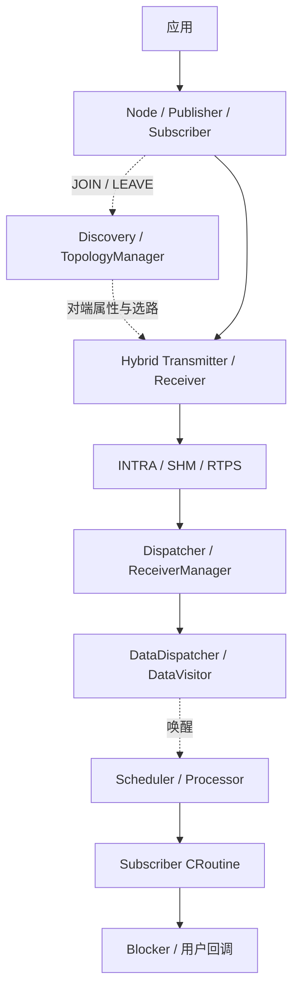

| 层 | 主要职责 | 入口 |
| --- | --- | --- |
| 应用接口 | 创建节点和端点、发布、订阅 | [node](../node/) |
| 拓扑控制 | 管理 Node/Reader/Writer，交换 JOIN/LEAVE | [discovery](../discovery/) |
| 数据传输 | 自动选路、后端收发、共享内存 Loan | [transport](../transport/) |
| 缓存执行 | 缓存消息、唤醒任务、运行回调 | [data](../data/)、[scheduler](../scheduler/)、[croutine](../croutine/) |
| 公共能力 | 配置、序列化、日志、时间和基础容器 | [config](../config/)、[serialize](../serialize/)、[common](../common/)、[base](../base/) |

## 启动与对象创建

1. `Init(binary_name)` 初始化日志和 GlobalData，不会创建完整通信运行时。
2. `CreateNode(name)` 取得 TopologyManager；Discovery 初始化失败时返回空指针。
3. 创建 Publisher 时建立 Transmitter，监听 Reader 变化，并把 Writer 加入拓扑。
4. 创建 Subscriber 时建立 Receiver、DataVisitor 和调度任务，监听 Writer 变化，并把 Reader 加入拓扑。
5. 两端既查询已存在角色，也订阅后续变化，因此不依赖固定创建顺序。

下面的时序图强调对象是按需创建的，而不是由 `Init()` 一次性构造全部运行时：

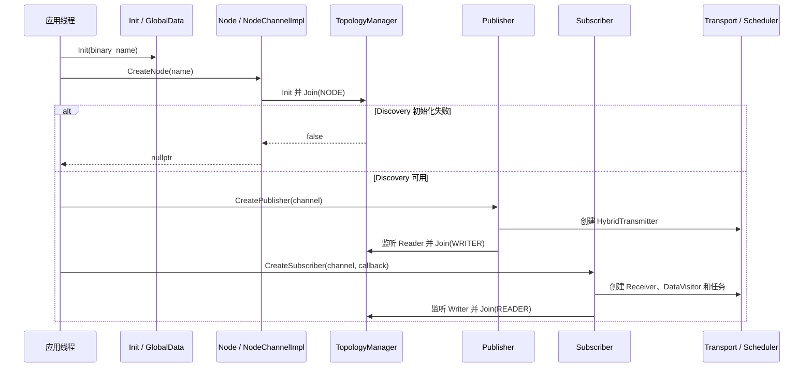

TopologyManager 初始化 Participant 和两个 Manager 时使用临时所有权；中途失败会回收已创建的
Writer、Reader、history、listener 和 Participant。失败后可修正环境并重试。Node 的失败传播、
消息类型检查和完整同步约定见 [README](../README.md#消息类型与初始化失败)。

主要对象关系：

- Node 持有 NodeChannelImpl 和自身创建的 Subscriber；Publisher 由调用者持有。
- Publisher/Subscriber 持有对应 Hybrid 端点和拓扑监听连接。
- `ReceiverManager<MessageT>` 按消息类型与 channel 缓存底层 Receiver；每个 Subscriber 仍有独立的
  DataVisitor、待处理缓存和用户回调。
- Discovery 与业务 Transport 使用各自的 Participant 包装对象，底层 Fast DDS Participant 按需创建。

配置结构和解析入口见[配置说明](../config/config.md)。当前主调度路径是 classic；配置本身
不构成硬实时保证。

## 发现如何驱动选路

NodeManager 管节点，ChannelManager 管 Reader/Writer、索引和节点关系图。Manager 把本地操作转换为
`ChangeMsg`：先检查并更新本地拓扑，再通知本地监听者和远端进程。远端收到后解码、校验、过滤
同进程消息，然后进入相同的角色维护逻辑。

Publisher 收到 Reader JOIN 后启用发送 peer；Subscriber 收到 Writer JOIN 后注册接收 peer。
Hybrid 根据双方元数据选择后端：

| 双方关系 | 路径 |
| --- | --- |
| 相同 IP、相同 PID | INTRA |
| 相同 IP、不同 PID | SHM |
| 不同 IP | RTPS |

一个 Publisher 可以同时启用多种路径。重复 JOIN 不重复计数；最后一个同模式 peer 离开后才停用
该发送后端。自动选择依赖 Discovery 公告的 IP/PID，而非逐条消息探测网络。

以进程 B 新建 Subscriber、进程 A 已有 Publisher 为例，控制面的 JOIN 最终启用数据面后端：

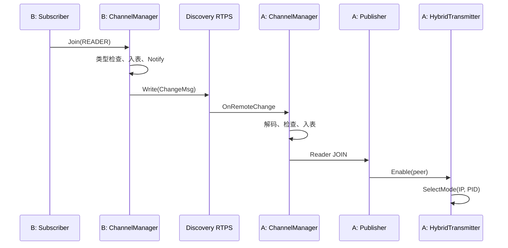

Subscriber 同时会查询已经存在的 Writer，并监听未来的 Writer JOIN。这样无论哪一端先创建，接收侧
最终都能为相应 Writer 安装 peer。类型检查失败时不会入表、Notify 或广播。

Discovery 使用独立的可靠、TRANSIENT_LOCAL 拓扑通道，使后启动进程能取得仍在线角色；这不代表
业务消息会离线补发。容量、QoS 和类型冲突行为见 [README](../README.md#qos-配置与执行边界)。

源码入口：[topology_manager.cpp](../discovery/topology_manager.cpp)、
[manager.cpp](../discovery/specific_manager/manager.cpp)、
[channel_manager.cpp](../discovery/specific_manager/channel_manager.cpp)和
[transport_mode.h](../config/transport_mode.h)。

## 一条普通消息的完整路径

`Publisher::Publish` 把消息交给 HybridTransmitter。Hybrid 取得当前路由快照后，依次尝试活跃的
INTRA、SHM、RTPS 后端；每种模式发送一次，同模式的多个订阅者由接收侧分发。

| 后端 | 发送与接收 |
| --- | --- |
| INTRA | 传递同一 `shared_ptr`，同步进入进程内 Dispatcher |
| SHM | DataStream 编码后写共享 Block，以 Notifier 发布块位置；接收线程校验并解码 |
| RTPS | DataStream 编码后写 Fast DDS History；DDS listener 复制并完整解码后分发 |

后端 Receiver 把消息交给 ReceiverManager，再进入 DataDispatcher 和每个 DataVisitor 的 ChannelBuffer。
DataNotifier 记录数据更新并唤醒对应线程组；Processor 下次选取任务时调用 `UpdateState()` 判断协程
是否 READY。协程恢复后通过 DataVisitor 的 `TryFetch` 取消息，随后更新 Blocker 并执行用户回调。

线程边界决定了“收到数据”和“执行用户函数”是两个阶段：

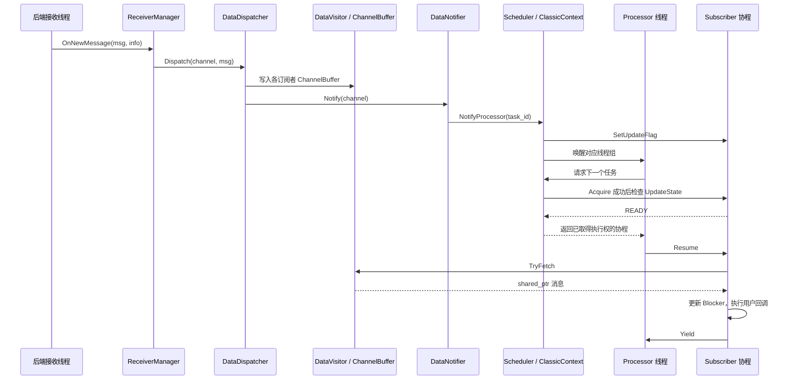

INTRA 的接收入口是发布线程，SHM 使用 ShmDispatcher 线程，RTPS 使用 Fast DDS 回调线程；用户回调
通常运行在 Processor 线程。Publish 返回值不等于接收确认或回调完成，多路径也可能部分成功。
更短的排查路线见[通信流程](transport.md)。

## 共享内存的数据与通知

SHM 的 Segment 保存 Payload Block、长度、代次和读写状态；Notifier 只广播 host、channel、block
index 和 generation。接收端根据通知取得读 Lease，校验代次和边界，再解码或建立 Loan View。

通知发布前写 Lease 已释放，因此慢读者取得读 Lease 前，块可能被复用。generation 用于拒绝过期通知；
Notifier 是有界广播环，允许覆盖和丢弃。布局、容量和兼容规则见
[README 的共享区说明](../README.md#共享区布局-v3-与兼容性)。

普通 SHM 消息的 Lease 与通知顺序如下。通知只携带定位信息，不替读者预先占有 Payload Block：

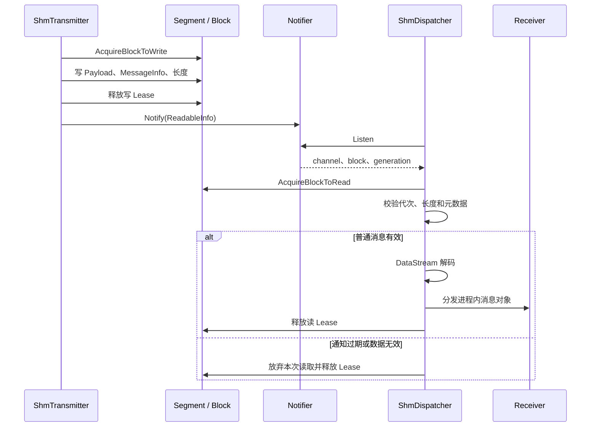

源码入口：[segment.h](../transport/shm/segment.h)、[block.h](../transport/shm/block.h)、
[condition_notifier.cpp](../transport/shm/condition_notifier.cpp)和
[shm_dispatcher.cpp](../transport/dispatcher/shm_dispatcher.cpp)。

## Loan 的存储选择与所有权

`AcquireMessage` 与 `Publish` 分开。仅 SHM 活跃时可直接借出共享 Block；若存在 INTRA 或 RTPS，
使用 heap 存储，并按后端共享或复制。借出后拓扑变化时，发送端会重新检查路由，必要时生成 heap
快照；旧 SHM Loan 在后端重新启用后因 epoch 不匹配而失效。

Acquire 时选择存储，Publish 时再次检查路由与 Loan 状态：

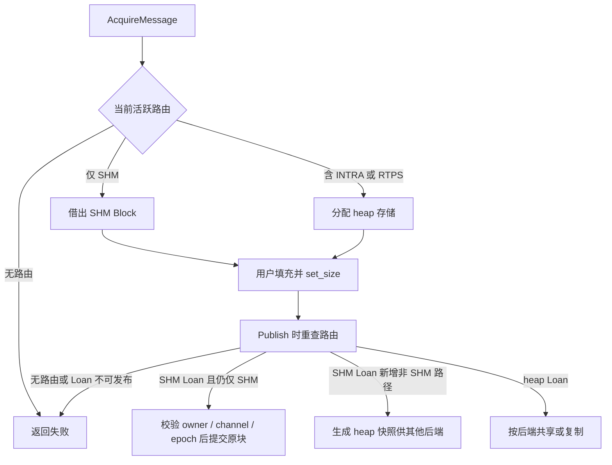

如果 Publish 时 SHM 路线仍然活跃，原 SHM Block 仍须通过 owner、channel 和 epoch 校验后提交；
heap 快照只服务新增的非 SHM 后端，不能替代活跃 SHM 路线对原块的提交。

接收侧 View 持有读 Lease 与映射，最后一个共享引用释放后块才可复用。裸数据指针不能超过 View
生命周期。这里的“零拷贝”只描述纯 SHM Payload 的中间复制，不包括通知、元数据、调度和用户处理。
详见 [README](../README.md#loanedmessage-零拷贝)与[测试指南](../example/TESTING.md#面试通信-demo)。

读 Lease 会随 View 穿过缓存和回调，不能在 ShmDispatcher 返回时提前释放：

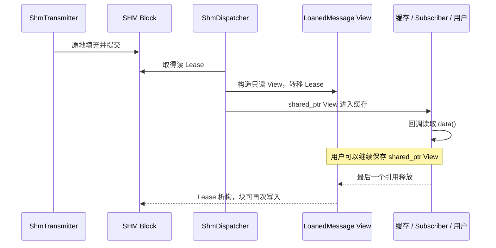

## 缓存与协程如何触发回调

每个 Subscriber 有独立 DataVisitor。接收后先写 ChannelBuffer，再通过 DataNotifier 唤醒所属任务；
Processor 选择 READY 协程，协程取出消息、更新 Blocker 并调用用户函数，然后主动 Yield。

传输 History、SHM Block、Notifier 环、DataVisitor 待处理缓存和 Blocker 观察缓存是不同层次的容量。
消费者落后并发生覆盖时，DataVisitor 可能跳到最新消息，因此底层收到不等于回调逐条处理。
`Observe()` 只生成 Blocker 快照，不驱动网络接收。

| 缓存位置 | 保存内容 | 主要消费者与边界 |
| --- | --- | --- |
| Fast DDS History | DDS 样本与协议状态 | DDS 内部；受 QoS history 和资源上限约束 |
| SHM Segment | Payload Block 与读写状态 | ShmDispatcher；Lease 和 generation 决定是否可读写 |
| Notifier | 可读块描述符 | 每个接收进程的监听线程；有界并允许覆盖 |
| DataVisitor / ChannelBuffer | 进程内消息 `shared_ptr` | Subscriber 协程；消费者落后时可能跳到最新值 |
| Blocker | 已进入 Subscriber 流程的消息引用 | `Observe()` 快照；容量与待处理队列分开配置 |

这是协作式调度；长时间阻塞的用户回调会占用 Processor。线程、优先级与唤醒规则见
[调度器](scheduler.md)和[协程](croutine.md)。

下面从缓存角度展示同一通道怎样唤醒多个独立订阅任务：

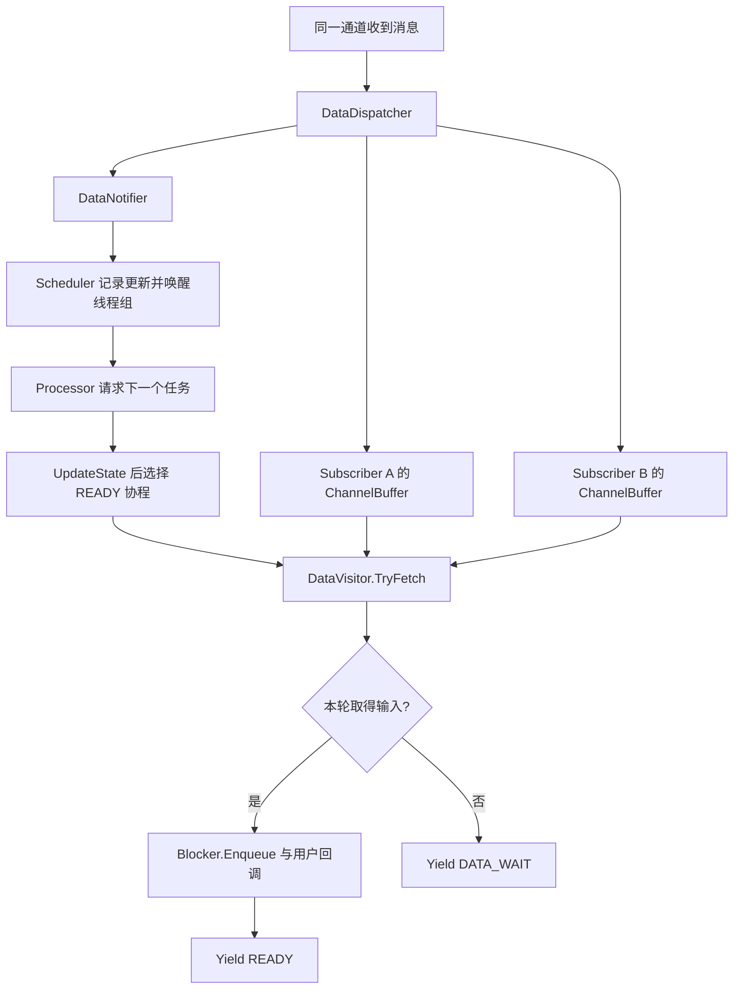

图中的 `TryFetch` 表示当前被调度的 Subscriber；两个 ChannelBuffer 不会合并为一份消费游标。

## 辅助能力与预留模块

`data` 还提供多输入 AllLatest。它由第一个输入 M0 触发，读取其他输入的最新值；只有所需输入都存在
才形成一组数据。它不是按时间戳对齐的同步器，Node 也没有自动建立完整 Component DAG。

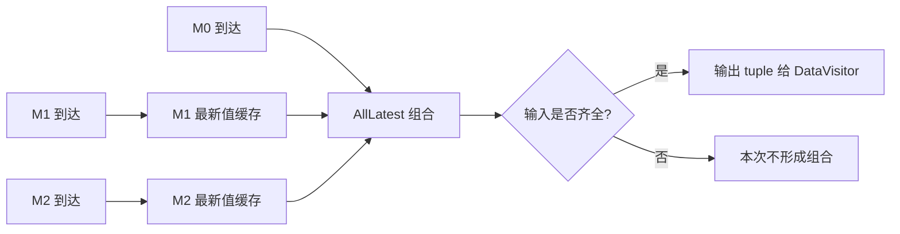

TaskManager 是另一条主动调用的执行路径。异步函数进入有界队列，再由调度器中的任务池协程消费；
满队列或停止后可能返回无效 future，调用者需要检查。

ClassLoader 负责扩展类型的装载与实例管理，但不会在创建 Node 时自动扫描动态库：

`component` 尚未形成完整 DAG 宿主；choreography 调度分支也未接入主工厂路径。`event` 和 `sysmo`
按开关或显式调用启用，`Init()` 不自动启动。这些辅助模块都不是普通 Publish/Subscribe 的必经路径。

源码入口：[all_latest.h](../data/all_latest.h)、[task_manager.cpp](../task/task_manager.cpp)、
[class_loader.cpp](../class_loader/class_loader.cpp)和[component_base.h](../component/component_base.h)。

## 离开重连与进程退出

Subscriber 正常关闭时发送 Reader LEAVE，Publisher 据此移除 peer；后续 JOIN 可再次启用后端。
Participant 离线也会触发拓扑清理，但时机取决于 DDS 发现机制。

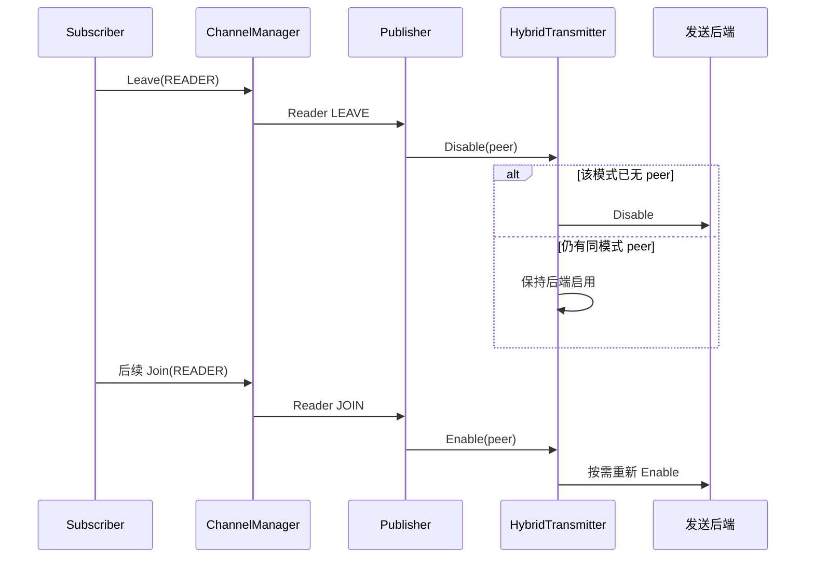

TopologyManager 显式关闭时先阻止新生命周期操作，停止并等待在飞 Discovery listener 回调，再关闭
Manager 端点和 Participant，最后释放 listener；重复关闭安全，之后可重新 Init。Manager 自身的
`Shutdown()` 是终止操作。生命周期切换应从回调之外的控制线程发起。

应用退出必须先停止业务调用，并关闭或排空所有可能访问 Publisher、Subscriber 和 Node 的拓扑回调，
再执行端点 Shutdown 和对象销毁。TaskManager 等任务生产者也须先于其使用的 Node、Scheduler 等资源停止。
`Transport::Shutdown()` 不会替应用关闭其他子系统；仓库当前也没有统一的全局退出宿主。

下面按通信 Demo 涉及的局部资源展示清理路线。第一步是调用者必须满足的前置条件，不是已有的统一关闭 API：

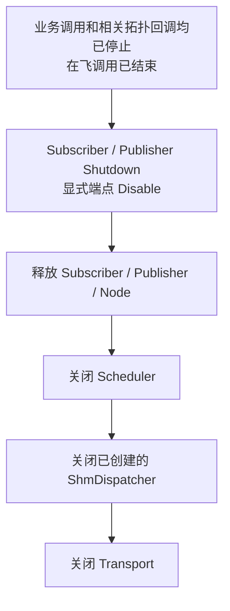

这不是任意并发下都安全的通用序列，也不是自动执行的全局 API。Demo 没有使用全部可选模块；若应用
使用 TaskManager、SysMo、TopologyManager 的显式 Shutdown 或独立监听连接，须由控制线程按真实依赖
补入流程。TopologyManager 的整体 Shutdown 会排空其 Discovery listener，并影响进程内所有 Node；
需要正常 LEAVE 时，也须在上述静默条件下完成。Signal Disconnect 本身不等待在飞回调，不能充当排空屏障。

## 源码阅读路线与验证入口

| 问题 | 阅读路线 |
| --- | --- |
| Node 怎样连接各层 | [init.cpp](../init.cpp) → [node.cpp](../node/node.cpp) → [node_channel_impl.h](../node/node_channel_impl.h) |
| 对端加入后怎样选路 | [发现与拓扑](topology.md) → ChannelManager → Publisher/Subscriber → Hybrid |
| 消息怎样跨进程 | [通信流程](transport.md) → SHM 或 RTPS Dispatcher → ReceiverManager |
| 消息怎样触发回调 | DataDispatcher → DataNotifier → [调度器](scheduler.md) → [协程](croutine.md) |
| 自定义类型怎样编码 | [序列化](serialize.md) → [data_stream.h](../serialize/data_stream.h) |
| 怎样构建和验证 | [测试指南](../example/TESTING.md)、[测试记录](../example/testlog.md) |

图和流程表示源码关系，不替代测试证据。实际结果须区分同机 INTRA、跨进程 SHM、同机强制 RTPS、
受控元数据路由和真实跨主机验证。
