# MINI CyberRT 总体架构

本文沿当前仓库源码，把应用创建节点、发现对端、发送消息、触发用户回调和退出的过程串起来。
架构图使用 Mermaid，可直接在支持 Mermaid 的 Markdown 预览中查看。
API、并发和兼容性约定以 [README](../README.md#功能与使用边界) 为准；这里侧重模块关系与运行过程。

## 阅读导航

- [整体分层与模块职责](#整体分层与模块职责)
- [启动与对象创建](#启动与对象创建)
- [发现如何驱动选路](#发现如何驱动选路)
- [一条普通消息的完整路径](#一条普通消息的完整路径)
- [共享内存的数据与通知](#共享内存的数据与通知)
- [Loan 的存储选择与所有权](#loan-的存储选择与所有权)
- [缓存与协程如何触发回调](#缓存与协程如何触发回调)
- [辅助能力与预留模块](#辅助能力与预留模块)
- [离开重连与进程退出](#离开重连与进程退出)
- [源码阅读路线与验证入口](#源码阅读路线与验证入口)

## 整体分层与模块职责

项目是一套 C++ 发布订阅通信运行时。应用通过 Node 创建 Publisher 和 Subscriber；
Discovery 维护“谁在什么位置订阅哪个 channel”，Transport 据此选择消息路径；
接收端把消息写入本地缓存，再由调度器恢复 Subscriber 协程执行用户回调。

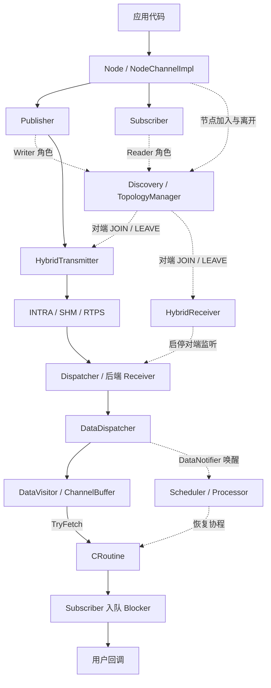
```mermaid
flowchart TB
    APP[应用代码] --> NODE[Node / NodeChannelImpl]
    NODE --> PUB[Publisher]
    NODE --> SUB[Subscriber]
    NODE -. 节点加入与离开 .-> DISC[Discovery / TopologyManager]
    PUB -. Writer 角色 .-> DISC
    SUB -. Reader 角色 .-> DISC
    DISC -. 对端 JOIN / LEAVE .-> HT[HybridTransmitter]
    DISC -. 对端 JOIN / LEAVE .-> HR[HybridReceiver]
    PUB --> HT
    HT --> PATH[INTRA / SHM / RTPS]
    PATH --> RX[Dispatcher / 后端 Receiver]
    HR -. 启停对端监听 .-> RX
    RX --> DD[DataDispatcher]
    DD --> DV[DataVisitor / ChannelBuffer]
    DD -. DataNotifier 唤醒 .-> SCH[Scheduler / Processor]
    SCH -. 恢复协程 .-> CR[CRoutine]
    DV -->|TryFetch| CR
    CR --> ENQ[Subscriber 入队 Blocker]
    ENQ --> CB[用户回调]
```

实线表示创建关系或消息处理路径，虚线表示拓扑控制、监听与唤醒。
其中有三条相互衔接的主线：

| 主线 | 核心问题 | 主要模块 |
| --- | --- | --- |
| 拓扑控制 | 对端是谁、在哪里、加入还是离开 | `discovery`、`RoleAttributes`、Hybrid peer 管理 |
| 消息传输 | 消息怎样抵达接收进程 | `transport`、`serialize`、SHM Segment/Notifier、Fast DDS |
| 回调执行 | 消息何时交给哪个用户任务 | `data`、`scheduler`、`croutine`、`blocker` |

目录之间的职责划分如下。辅助模块可被应用单独使用，不是每次 Publish 都会经过它们。

| 目录或入口 | 职责及上下游 |
| --- | --- |
| [init.cpp](../init.cpp)、[common](../common/)、[config](../config/) | 初始化日志和全局主机/进程信息，解析配置，提供节点与通道标识 |
| [node](../node/) | 面向应用的 Node、Publisher、Subscriber；连接拓扑、传输和调度 |
| [discovery](../discovery/) | Node/Reader/Writer 角色管理、通道索引和节点关系图，通过 DDS 交换拓扑变更 |
| [transport](../transport/) | Endpoint、Hybrid 选路、三种后端、接收分发以及 Loan 生命周期 |
| [serialize](../serialize/) | 普通消息的 DataStream 编解码；供 SHM、RTPS 和拓扑消息使用 |
| [data](../data/) | 接收后的进程内缓存、通知、DataVisitor 和多输入融合基础实现 |
| [scheduler](../scheduler/)、[croutine](../croutine/) | Processor 线程调度栈式协程，让等待数据的任务恢复运行 |
| [blocker](../blocker/) | Subscriber 已处理消息的历史缓存和 Observe 快照 |
| [task](../task/) | 把异步函数放入任务队列，由调度器中的任务协程消费 |
| [class_loader](../class_loader/)、[component](../component/) | 动态库加载与类注册；Component 运行链路尚未完整接通 |
| [base](../base/)、[time](../time/)、[log](../log/) | 信号、锁、队列、对象池、时间工具和日志 |
| [event](../event/)、[sysmo](../sysmo/) | 性能事件与监控辅助能力，是否启用取决于实现开关和显式初始化 |
| [example](../example/) | 应用示例、测试、benchmark 和构建入口，不属于消息运行时本身 |

## 启动与对象创建

应用负责调用初始化接口、创建节点并保持业务循环。当前仓库没有完整的组件 DAG 加载器，
也没有一个会自动启动、关闭全部子系统的统一应用宿主。

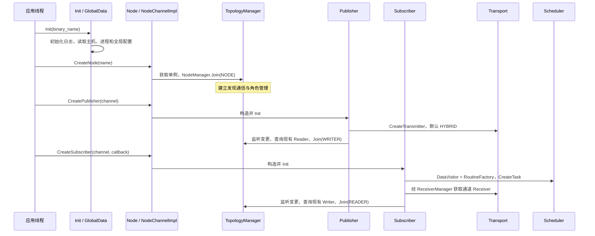
```mermaid
sequenceDiagram
    participant A as 应用线程
    participant G as Init / GlobalData
    participant N as Node / NodeChannelImpl
    participant D as TopologyManager
    participant P as Publisher
    participant S as Subscriber
    participant T as Transport
    participant Q as Scheduler
    A->>G: Init(binary_name)
    G->>G: 初始化日志，读取主机、进程和全局配置
    A->>N: CreateNode(name)
    N->>D: 获取单例，NodeManager.Join(NODE)
    Note over D: 建立发现通信与角色管理
    A->>N: CreatePublisher(channel)
    N->>P: 构造并 Init
    P->>T: CreateTransmitter，默认 HYBRID
    P->>D: 监听变更、查询现有 Reader、Join(WRITER)
    A->>N: CreateSubscriber(channel, callback)
    N->>S: 构造并 Init
    S->>Q: DataVisitor + RoutineFactory，CreateTask
    S->>T: 经 ReceiverManager 获取通道 Receiver
    S->>D: 监听变更、查询现有 Writer、Join(READER)
```

图中展示一种创建顺序；Publisher 和 Subscriber 也可以反过来创建。
双方都会先注册变更监听、查询已存在的对端，再宣布自身角色，因此既处理已有角色，也处理后续 JOIN。

资源按需创建：`Init()` 当前只初始化 Logger 与 GlobalData；创建 Node 才会取得 TopologyManager，
创建传输端点和订阅任务时才会取得 Transport、Scheduler 等对象。
Discovery 与 Transport 各有自己的 Participant 包装对象，底层 Fast DDS Participant 在需要时创建。
即使用户消息只走 INTRA，Node 的发现链路仍会使用 Fast DDS。

配置进入运行时的关系是：

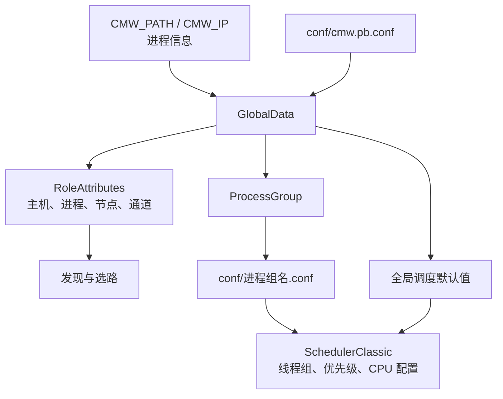
```mermaid
flowchart TB
    ENV["CMW_PATH / CMW_IP<br/>进程信息"] --> GD[GlobalData]
    GLOBAL[conf/cmw.pb.conf] --> GD
    GD --> ATTR["RoleAttributes<br/>主机、进程、节点、通道"]
    ATTR --> DISC[发现与选路]
    GD --> GROUP[ProcessGroup]
    GROUP --> FILE[conf/进程组名.conf]
    FILE --> CLASSIC["SchedulerClassic<br/>线程组、优先级、CPU 配置"]
    GD --> DEFAULT[全局调度默认值]
    DEFAULT --> CLASSIC
```

`cmw.pb.conf` 在本仓库由 JSON 解析器读取，不能仅凭后缀当作 protobuf 文本配置。
调度工厂先尝试进程组配置，缺少配置时默认选择 `classic`。
`choreography` 的工厂分支尚未创建实例，不应将它作为已接通的调度策略使用。
配置字段与路径规则见 [配置说明](../config/config.md)，日志路径规则见 [统一日志目录](../README.md#统一日志目录)。

Node 持有自身创建的 Subscriber，并限制同一 Node 对同一通道重复创建订阅；Publisher 由调用者持有。
`ReceiverManager<MessageT>` 按消息类型和通道缓存底层 Receiver，多个订阅任务可以共享接收入口，
但各自拥有 DataVisitor、待处理缓存及用户回调。

## 发现如何驱动选路

NodeManager 管节点，ChannelManager 管 Reader/Writer 及其索引和关系图。
共同基类 Manager 把角色操作转换为 `ChangeMsg`：先应用到本地，再通过发现通道发送给其他进程。
本地角色变更无需绕一次网络；远端收到后也进入同一套角色维护和通知逻辑。

下面以“进程 A 已有 Publisher，进程 B 新增 Subscriber”为例：

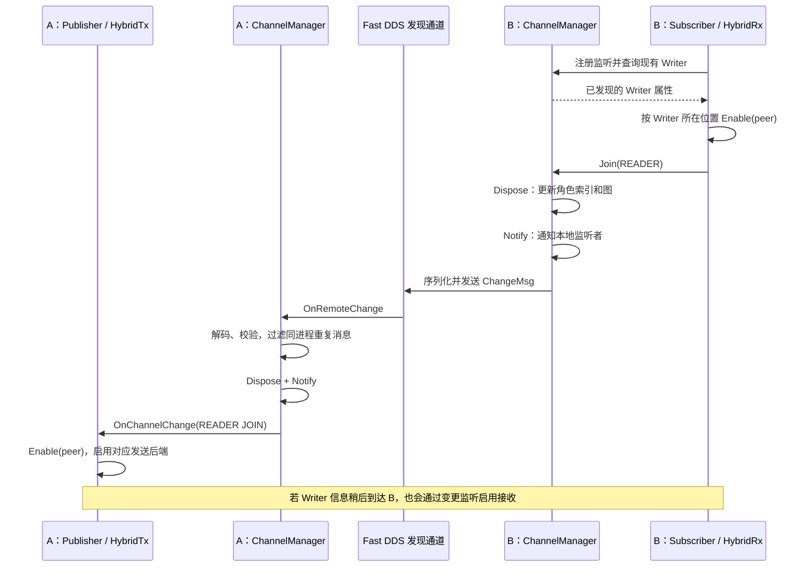
```mermaid
sequenceDiagram
    participant P as A：Publisher / HybridTx
    participant DA as A：ChannelManager
    participant DDS as Fast DDS 发现通道
    participant DB as B：ChannelManager
    participant S as B：Subscriber / HybridRx
    S->>DB: 注册监听并查询现有 Writer
    DB-->>S: 已发现的 Writer 属性
    S->>S: 按 Writer 所在位置 Enable(peer)
    S->>DB: Join(READER)
    DB->>DB: Dispose：更新角色索引和图
    DB->>DB: Notify：通知本地监听者
    DB->>DDS: 序列化并发送 ChangeMsg
    DDS->>DA: OnRemoteChange
    DA->>DA: 解码、校验，过滤同进程重复消息
    DA->>DA: Dispose + Notify
    DA->>P: OnChannelChange(READER JOIN)
    P->>P: Enable(peer)，启用对应发送后端
    Note over P,S: 若 Writer 信息稍后到达 B，也会通过变更监听启用接收
```

发现通道使用 `RELIABLE + TRANSIENT_LOCAL`，用于保留一定范围内的拓扑历史，
让后启动进程获知仍在线的角色。这与业务 Payload 的缓存、可靠性和历史回放是不同机制，
不能据此推导“离线期间的业务消息会补发”。具体边界见
[发现容量](../README.md#discovery-拓扑通知容量)与[后启动进程发现](../README.md#discovery-后启动进程发现)。

Hybrid 根据对端角色属性选路，判断代码位于 [transport_mode.h](../config/transport_mode.h)：

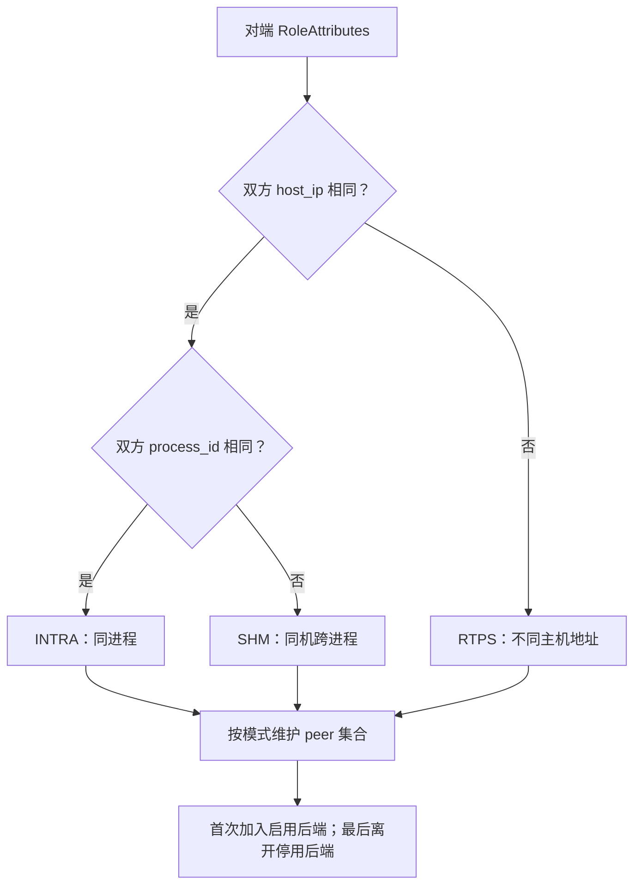
```mermaid
flowchart TD
    PEER[对端 RoleAttributes] --> HOST{双方 host_ip 相同？}
    HOST -->|否| RTPS[RTPS：不同主机地址]
    HOST -->|是| PID{双方 process_id 相同？}
    PID -->|是| INTRA[INTRA：同进程]
    PID -->|否| SHM[SHM：同机跨进程]
    INTRA --> SET[按模式维护 peer 集合]
    SHM --> SET
    RTPS --> SET
    SET --> ACTIVE[首次加入启用后端；最后离开停用后端]
```

这依赖双方发布的主机与进程元数据，并非每条业务消息都探测网络。
对端以 endpoint id 等信息去重；重复 JOIN 不应重复累加。
同一 Publisher 可以同时有三种位置的订阅者，所以 INTRA、SHM、RTPS 可以同时活跃。
低层 Transport 允许显式创建某一种后端；Node 的默认自动选路由发现链路驱动。

源码入口：[topology_manager.cpp](../discovery/topology_manager.cpp)、
[manager.cpp](../discovery/specific_manager/manager.cpp)、
[channel_manager.cpp](../discovery/specific_manager/channel_manager.cpp)、
[HybridTransmitter](../transport/transmitter/hybrid_transmitter.h)、
[HybridReceiver](../transport/receiver/hybrid_receiver.h)。

## 一条普通消息的完整路径

普通消息指通过 `DataStream` 序列化的消息类型。`Publish(const M&)` 先构造共享消息对象；
`Publish(shared_ptr<M>)` 则把已有共享对象交给传输端。
Transmitter 为本次发送准备序号与 MessageInfo，Hybrid 在锁内取得活跃路由快照，解锁后依次发送。

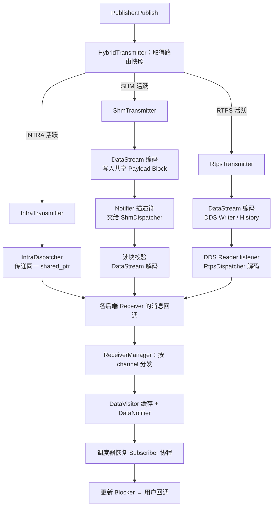
```mermaid
flowchart TD
    PUB[Publisher.Publish] --> HT[HybridTransmitter：取得路由快照]
    HT -->|INTRA 活跃| IT[IntraTransmitter]
    HT -->|SHM 活跃| ST[ShmTransmitter]
    HT -->|RTPS 活跃| RT[RtpsTransmitter]
    IT --> IP["IntraDispatcher<br/>传递同一 shared_ptr"]
    ST --> SP["DataStream 编码<br/>写入共享 Payload Block"]
    SP --> SN["Notifier 描述符<br/>交给 ShmDispatcher"]
    SN --> SD["读块校验<br/>DataStream 解码"]
    RT --> RP["DataStream 编码<br/>DDS Writer / History"]
    RP --> RR["DDS Reader listener<br/>RtpsDispatcher 解码"]
    IP --> RX[各后端 Receiver 的消息回调]
    SD --> RX
    RR --> RX
    RX --> RM[ReceiverManager：按 channel 分发]
    RM --> DV[DataVisitor 缓存 + DataNotifier]
    DV --> RUN[调度器恢复 Subscriber 协程]
    RUN --> USER[更新 Blocker → 用户回调]
```

图中分支表示活跃模式，实际发送尝试顺序是 INTRA → SHM → RTPS。
每种活跃模式只发送一次，由后端向该模式的多个订阅者分发。
某条路径失败后仍会尝试其他路径，最终返回各次发送结果的合取；已经送出的消息不会回滚。
普通消息没有活跃路由时也可能返回 true，因此 Publish 成功不能代替接收端送达确认。
完整约定见 [混合传输](../README.md#discovery-驱动的混合传输)。

接收分为两个阶段，线程边界如下：

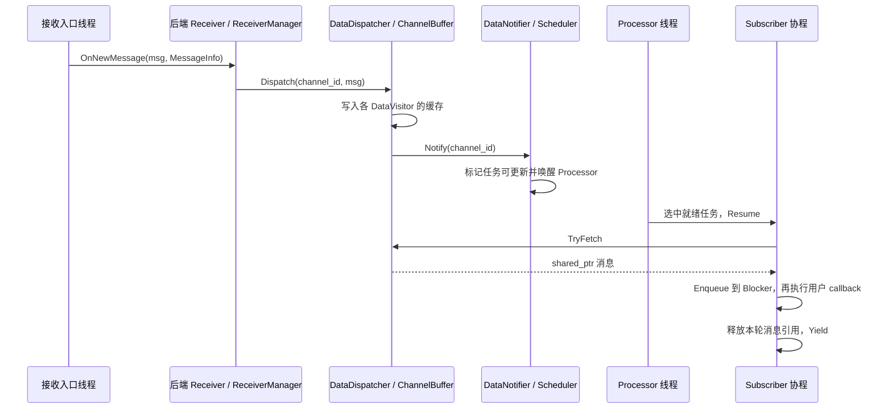
```mermaid
sequenceDiagram
    participant IO as 接收入口线程
    participant R as 后端 Receiver / ReceiverManager
    participant D as DataDispatcher / ChannelBuffer
    participant N as DataNotifier / Scheduler
    participant P as Processor 线程
    participant C as Subscriber 协程
    IO->>R: OnNewMessage(msg, MessageInfo)
    R->>D: Dispatch(channel_id, msg)
    D->>D: 写入各 DataVisitor 的缓存
    D->>N: Notify(channel_id)
    N->>N: 标记任务可更新并唤醒 Processor
    P->>C: 选中就绪任务，Resume
    C->>D: TryFetch
    D-->>C: shared_ptr 消息
    C->>C: Enqueue 到 Blocker，再执行用户 callback
    C->>C: 释放本轮消息引用，Yield
```

| 接收后端 | “接收入口线程”实际是谁 | 缓存之前发生的工作 |
| --- | --- | --- |
| INTRA | 调用 Publish 的线程 | 同步调用 Dispatcher 和底层 Receiver 回调 |
| SHM | ShmDispatcher 自有接收线程 | 等待通知、取得读块、校验并解码或建立 Loan View |
| RTPS | Fast DDS 接收回调线程 | 复制收到的序列化数据，由 RtpsDispatcher 解码 |

Node 用户回调在 Processor 线程中的协程里运行，底层 Receiver 回调负责入缓存和唤醒。
唤醒只使任务有机会被调度，不代表立即执行；调度线程也可能在 Publish 返回前就开始处理，
因此不能依赖“Publish 返回”和“用户回调开始”之间的固定先后顺序。

## 共享内存的数据与通知

SHM 后端包含两类共享区域：Segment 保存 Payload 和块状态，Notifier 保存“哪个通道的哪个块可读”。
默认 Segment 使用 POSIX 共享内存，默认通知实现是 ConditionNotifier；
XSI Segment 与 MulticastNotifier 的源码仍保留，但不应把它们当作默认配置会自动选择的路径。

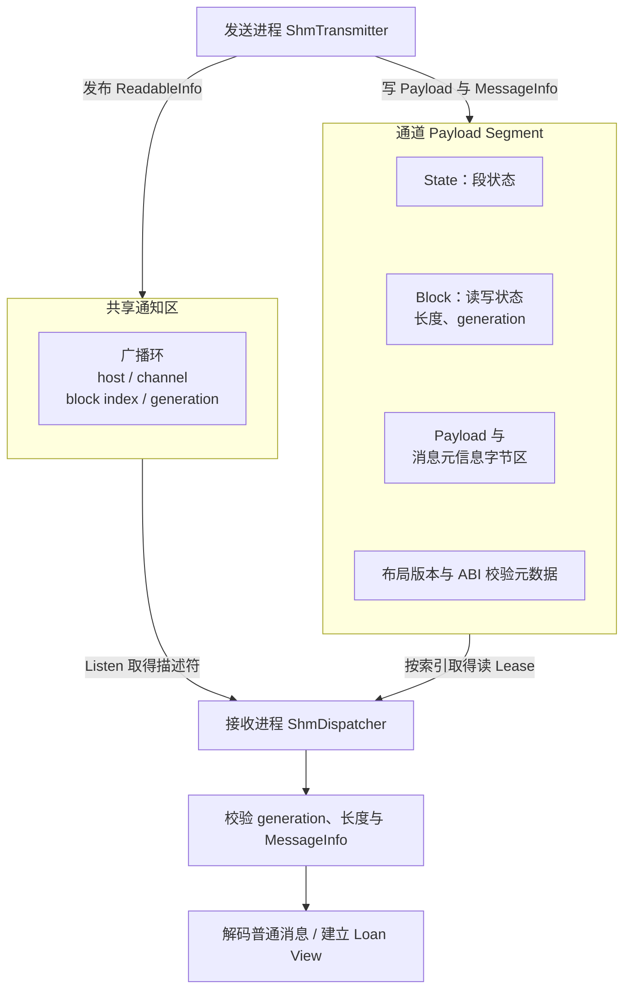
```mermaid
flowchart TB
    TX[发送进程 ShmTransmitter] -->|写 Payload 与 MessageInfo| SEG
    TX -->|发布 ReadableInfo| NOT
    subgraph SEG[通道 Payload Segment]
        direction TB
        STATE[State：段状态]
        BLOCK["Block：读写状态<br/>长度、generation"]
        BYTES["Payload 与<br/>消息元信息字节区"]
        ABI[布局版本与 ABI 校验元数据]
        %% 不可见连线只用于将共享区内容纵向排列。
        STATE ~~~ BLOCK ~~~ BYTES ~~~ ABI
    end
    subgraph NOT[共享通知区]
        direction TB
        RING["广播环<br/>host / channel<br/>block index / generation"]
    end
    NOT -->|Listen 取得描述符| RX[接收进程 ShmDispatcher]
    SEG -->|按索引取得读 Lease| RX
    RX --> CHECK[校验 generation、长度与 MessageInfo]
    CHECK --> MSG[解码普通消息 / 建立 Loan View]
```

共享区存可跨进程解释的数据与状态；映射地址、`shared_ptr` 和 Lease 管理对象属于各进程本地。
两个进程不需要把共享段映射到相同虚拟地址。
Payload 布局与 Notifier 布局各有版本，详细兼容性规则见
[共享区布局](../README.md#共享区布局-v2-与兼容性)。

普通 SHM 消息的顺序如下：

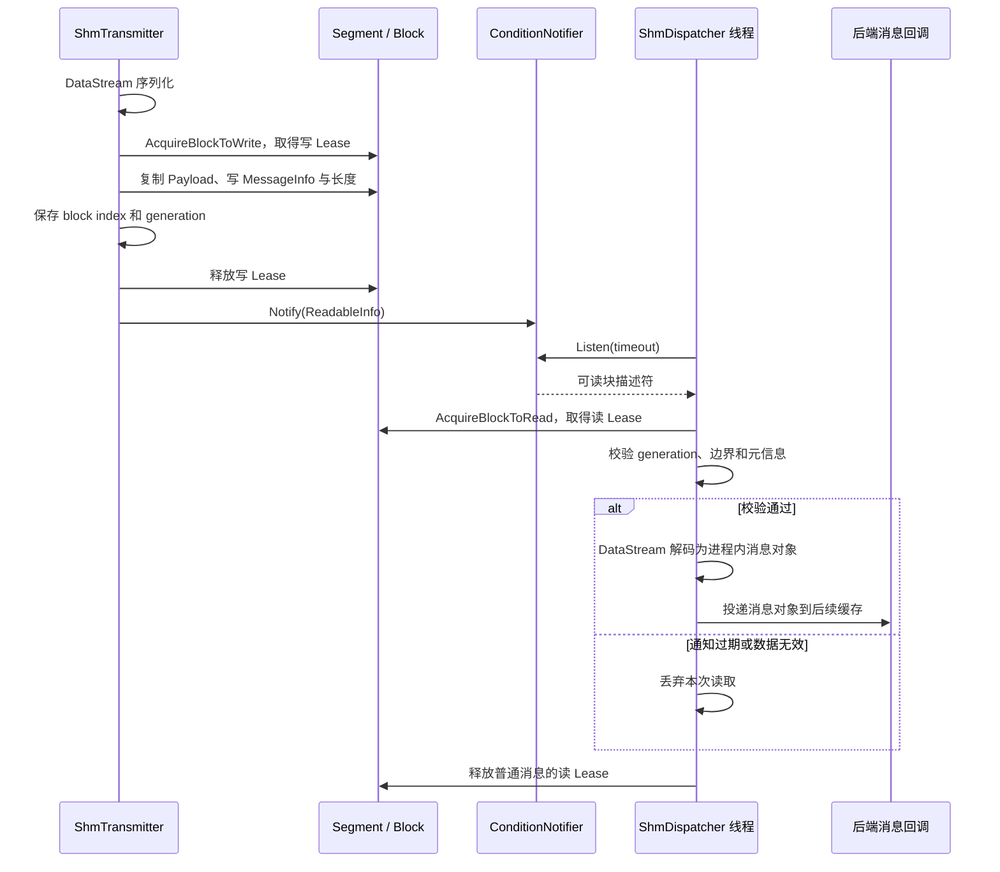
```mermaid
sequenceDiagram
    participant T as ShmTransmitter
    participant S as Segment / Block
    participant N as ConditionNotifier
    participant D as ShmDispatcher 线程
    participant R as 后端消息回调
    T->>T: DataStream 序列化
    T->>S: AcquireBlockToWrite，取得写 Lease
    T->>S: 复制 Payload、写 MessageInfo 与长度
    T->>T: 保存 block index 和 generation
    T->>S: 释放写 Lease
    T->>N: Notify(ReadableInfo)
    D->>N: Listen(timeout)
    N-->>D: 可读块描述符
    D->>S: AcquireBlockToRead，取得读 Lease
    D->>D: 校验 generation、边界和元信息
    alt 校验通过
        D->>D: DataStream 解码为进程内消息对象
        D->>R: 投递消息对象到后续缓存
    else 通知过期或数据无效
        D->>D: 丢弃本次读取
    end
    D->>S: 释放普通消息的读 Lease
```

通知不会预先替读者占住 Payload Block。写 Lease 释放后，尚未取得读 Lease 的块可能再次被复用；
generation 用来识别“通知指向的已经不是那一轮数据”。
Notifier 是允许覆盖和丢弃的有界广播环，Notify 返回 true 也不保证订阅者最终读到 Payload。
锁、游标和丢弃条件见 [Notifier 约定](../README.md#notifier-槽位保护与丢弃策略)。

源码入口：[shm_transmitter.h](../transport/transmitter/shm_transmitter.h)、
[shm_dispatcher.cpp](../transport/dispatcher/shm_dispatcher.cpp)、
[segment.h](../transport/shm/segment.h)、[block.h](../transport/shm/block.h)、
[condition_notifier.cpp](../transport/shm/condition_notifier.cpp)。

## Loan 的存储选择与所有权

`LoanedMessage` 把“申请可写存储”和“发布”分开，使纯 SHM 路径可以直接提交借出的 Payload Block。
它不是所有拓扑下都零拷贝的通用序列化替代品；存储取决于 Acquire 时和 Publish 时的活跃路由。

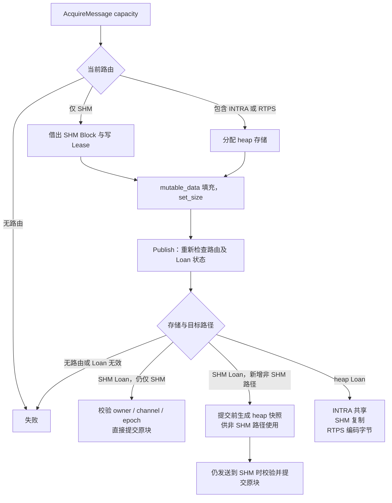
```mermaid
flowchart TD
    A[AcquireMessage capacity] --> ROUTE{当前路由}
    ROUTE -->|无路由| FAIL[失败]
    ROUTE -->|仅 SHM| SHM[借出 SHM Block 与写 Lease]
    ROUTE -->|包含 INTRA 或 RTPS| HEAP[分配 heap 存储]
    SHM --> FILL[mutable_data 填充，set_size]
    HEAP --> FILL
    FILL --> PUB[Publish：重新检查路由及 Loan 状态]
    PUB --> CASE{存储与目标路径}
    CASE -->|SHM Loan，仍仅 SHM| DIRECT["校验 owner / channel / epoch<br/>直接提交原块"]
    CASE -->|SHM Loan，新增非 SHM 路径| SNAP["提交前生成 heap 快照<br/>供非 SHM 路径使用"]
    CASE -->|heap Loan| COPY["INTRA 共享<br/>SHM 复制<br/>RTPS 编码字节"]
    CASE -->|无路由或 Loan 无效| FAIL
    SNAP --> COMMIT[仍发送到 SHM 时校验并提交原块]
```

SHM 借出路径使用不重建映射的块申请接口；容量不足或块不可用时失败。
`enable_epoch` 标识发送后端的一次启用周期：后端关闭再启用后，旧的 SHM Loan 不能再提交。
这与 Block 的 `generation` 不同，后者标识同一个块的某一轮写入，用于拒绝过期通知。

接收端的 View 则把块的可复用时间与消息对象生命周期关联起来：

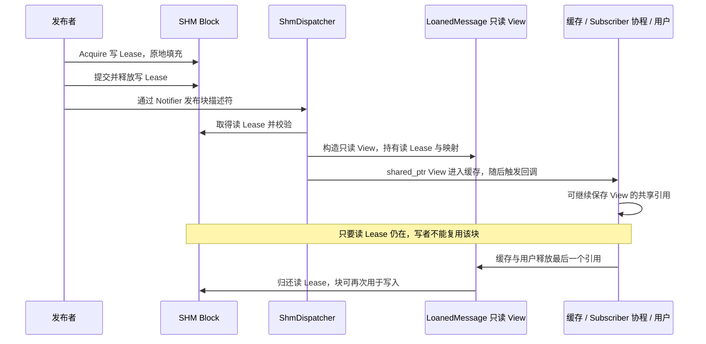
```mermaid
sequenceDiagram
    participant P as 发布者
    participant B as SHM Block
    participant D as ShmDispatcher
    participant V as LoanedMessage 只读 View
    participant C as 缓存 / Subscriber 协程 / 用户
    P->>B: Acquire 写 Lease，原地填充
    P->>B: 提交并释放写 Lease
    P->>D: 通过 Notifier 发布块描述符
    D->>B: 取得读 Lease 并校验
    D->>V: 构造只读 View，持有读 Lease 与映射
    D->>C: shared_ptr View 进入缓存，随后触发回调
    C->>C: 可继续保存 View 的共享引用
    Note over B,C: 只要读 Lease 仍在，写者不能复用该块
    C->>V: 缓存与用户释放最后一个引用
    V->>B: 归还读 Lease，块可再次用于写入
```

单消息 Subscriber 协程会在回调后、Yield 前释放自己的消息引用，但待处理缓存、Blocker 或用户保存的引用仍可能存在。
因此“回调已经返回”不等于“块已经归还”；持有较多 View 会降低可借出的块数量。
Lease 也保持本地映射存活，用户持有 Loan 不要求 Disable 一直等待。
具体 API 与并发边界见 [LoanedMessage](../README.md#loanedmessage-零拷贝)及
[发送端生命周期](../README.md#发送端生命周期与并发边界)，实现入口是
[loaned_message.h](../transport/message/loaned_message.h)。

## 缓存与协程如何触发回调

接收缓存负责把传输线程与用户任务分开。`DataDispatcher<MessageT>` 按 channel 找到各 DataVisitor 的缓存，
逐个写入共享消息引用，然后通过 DataNotifier 通知任务。
DataVisitor 保留自己的读取位置，`TryFetch` 是协程获取输入的入口。

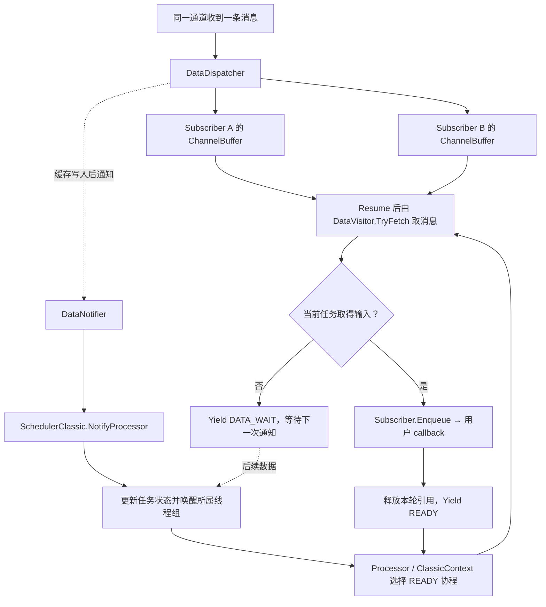
```mermaid
flowchart TD
    MSG[同一通道收到一条消息] --> DD[DataDispatcher]
    DD --> B1[Subscriber A 的 ChannelBuffer]
    DD --> B2[Subscriber B 的 ChannelBuffer]
    DD -. 缓存写入后通知 .-> DN[DataNotifier]
    DN --> NOTIFY[SchedulerClassic.NotifyProcessor]
    NOTIFY --> READY[更新任务状态并唤醒所属线程组]
    READY --> PICK[Processor / ClassicContext 选择 READY 协程]
    PICK --> FETCH[Resume 后由 DataVisitor.TryFetch 取消息]
    B1 --> FETCH
    B2 --> FETCH
    FETCH --> HAS{当前任务取得输入？}
    HAS -->|是| CALL[Subscriber.Enqueue → 用户 callback]
    CALL --> YIELD[释放本轮引用，Yield READY]
    YIELD --> PICK
    HAS -->|否| WAIT[Yield DATA_WAIT，等待下一次通知]
    WAIT -. 后续数据 .-> READY
```

每个 Subscriber 对应自己的协程和 DataVisitor，图中的 FETCH 表示当前被选中的那个任务。
`SchedulerClassic` 按线程组和优先级选择就绪协程，Processor 是实际 OS 工作线程，
`CRoutine` 保存栈与上下文，当前上下文切换实现位于 [swap_x86_64.S](../croutine/swap_x86_64.S)。
这是协作式调度：任务主动 Yield 才交还执行权；用户回调长时间阻塞，会占用对应 Processor，
线程组和优先级配置本身不构成硬实时保证。

不能把各层出现的“队列”视为同一个端到端 FIFO：

| 位置 | 保存内容 | 消费者与含义 |
| --- | --- | --- |
| Fast DDS History | DDS 样本及相关传输状态 | DDS 内部使用；发现历史和业务消息历史分属各自端点 |
| SHM Segment | Payload Block、长度、读写状态 | ShmDispatcher 按通知读取；块容量与 Lease 影响可写性 |
| ConditionNotifier | 可读块描述符 | 接收线程按自己的游标读取；有界且允许丢弃 |
| DataVisitor 的 ChannelBuffer/CacheBuffer | 进程内消息 `shared_ptr` | 对应订阅协程 TryFetch；容量由 pending queue 参数决定 |
| Subscriber 的 Blocker | 已进入 Subscriber 处理流程的消息引用 | 提供历史与 Observe 快照；历史容量与 pending queue 不同 |

`ChannelBuffer::Fetch` 初次读取从当前最新消息开始；读取位置落后、数据被覆盖后，也会跳到最新位置。
因此即使底层收到了多条消息，用户回调也不保证逐条处理全部消息。
`Observe()` 把 Blocker 的已发布缓存复制成观察快照，`GetLatestObserved()` 从快照取数据；
它们不会驱动网络接收，也不负责唤醒订阅回调。

源码入口：[subscriber.h](../node/subscriber.h)、[subscriber_base.h](../node/subscriber_base.h)、
[data_dispatcher.h](../data/data_dispatcher.h)、[channel_buffer.h](../data/channel_buffer.h)、
[croutine_factory.h](../croutine/croutine_factory.h)、[scheduler_classic.cpp](../scheduler/policy/scheduler_classic.cpp)、
[processor.cpp](../scheduler/processor.cpp)、[blocker.h](../blocker/blocker.h)。
模块展开见 [调度器](scheduler.md)和[协程](croutine.md)。

## 辅助能力与预留模块

除单通道订阅外，`data` 中还保留多输入 DataVisitor 与 `AllLatest` 融合基础实现。
它以第一个输入 M0 的到达为触发点，尝试取得其他输入的最新值，再形成一组输入；
这不是按时间戳对齐的同步器，也不表示 Node 已提供完整的多输入 Component 运行入口。

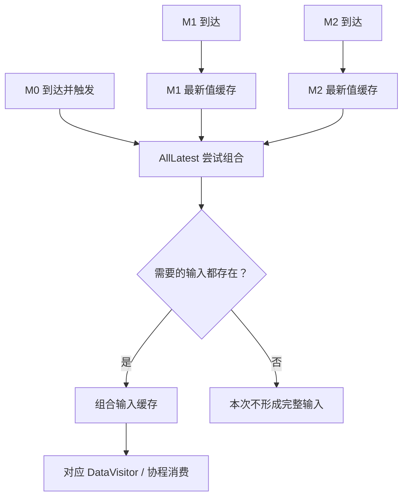
```mermaid
flowchart TB
    M1[M1 到达] --> C1[M1 最新值缓存]
    M2[M2 到达] --> C2[M2 最新值缓存]
    M0[M0 到达并触发] --> F[AllLatest 尝试组合]
    C1 --> F
    C2 --> F
    F --> ALL{需要的输入都存在？}
    ALL -->|是| TUPLE[组合输入缓存]
    TUPLE --> TASK[对应 DataVisitor / 协程消费]
    ALL -->|否| SKIP[本次不形成完整输入]
```

异步任务与动态加载分别连接到执行层和扩展层：

**异步函数任务**

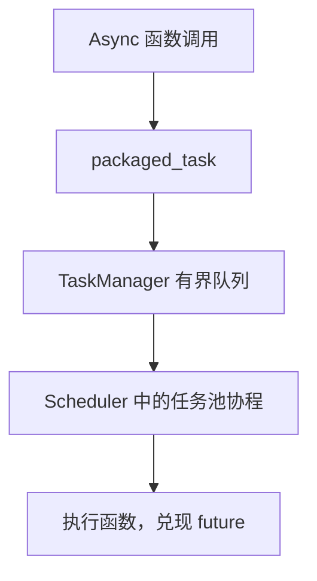
```mermaid
flowchart TB
    A[Async 函数调用] --> PKG[packaged_task]
    PKG --> Q[TaskManager 有界队列]
    Q --> CO[Scheduler 中的任务池协程]
    CO --> RUN[执行函数，兑现 future]
```

**动态类加载**

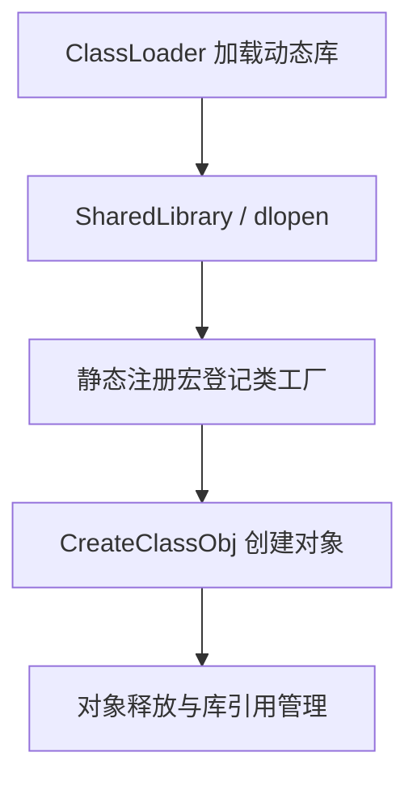
```mermaid
flowchart TB
    SO[ClassLoader 加载动态库] --> DL[SharedLibrary / dlopen]
    DL --> REG[静态注册宏登记类工厂]
    REG --> OBJ[CreateClassObj 创建对象]
    OBJ --> REF[对象释放与库引用管理]
```

这两条路径需要调用者主动使用。普通 Subscriber 并不先经过 `TaskManager`，
创建 Node 也不会自动扫描动态库、实例化 Component 或启动 DAG。

| 模块 | 当前接通程度 |
| --- | --- |
| `task` | 提供队列、任务池协程与 future；与 Subscriber 一样使用调度器资源 |
| `class_loader` | 有动态库封装、类注册、工厂创建和实例计数管理，可独立使用 |
| `component` | `ComponentBase` 仍有默认失败/空实现，Component 和定时组件文件尚为空壳 |
| `scheduler` 的 choreography | 存在相关源码，但工厂选择分支未实例化策略；主路径使用 classic |
| `event` | 主链路中保留性能事件调用，PerfEventCache 当前默认关闭 |
| `sysmo` | 需要取得实例并满足 `sysmo_start` 环境开关才启动监控，Init 不自动启动它 |
| `base`、`time`、`log` | 为各层提供同步、队列、内存池、时间和诊断工具，不负责业务选路 |

源码入口：[all_latest.h](../data/all_latest.h)、[task.h](../task/task.h)、
[task_manager.cpp](../task/task_manager.cpp)、[class_loader.cpp](../class_loader/class_loader.cpp)、
[component_base.h](../component/component_base.h)、[scheduler_factory.cpp](../scheduler/scheduler_factory.cpp)、
[perf_event_cache.cpp](../event/perf_event_cache.cpp)、[sysmo.cpp](../sysmo/sysmo.cpp)。

## 离开重连与进程退出

对端离开先影响拓扑和 peer 集合，再影响传输后端。以下展示正常显式 LEAVE 和后续 JOIN：

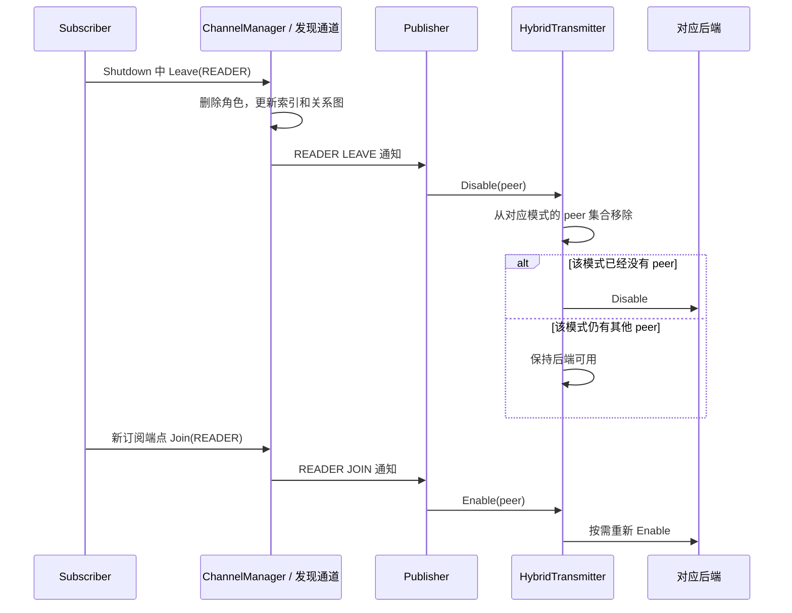
```mermaid
sequenceDiagram
    participant S as Subscriber
    participant D as ChannelManager / 发现通道
    participant P as Publisher
    participant H as HybridTransmitter
    participant B as 对应后端
    S->>D: Shutdown 中 Leave(READER)
    D->>D: 删除角色，更新索引和关系图
    D->>P: READER LEAVE 通知
    P->>H: Disable(peer)
    H->>H: 从对应模式的 peer 集合移除
    alt 该模式已经没有 peer
        H->>B: Disable
    else 该模式仍有其他 peer
        H->>H: 保持后端可用
    end
    S->>D: 新订阅端点 Join(READER)
    D->>P: READER JOIN 通知
    P->>H: Enable(peer)
    H->>B: 按需重新 Enable
```

接收侧收到 Writer LEAVE 时移除该 peer 的监听；底层通道 Receiver/Dispatcher 可以继续复用。
Subscriber 的 Shutdown 还会断开自身拓扑监听、释放所持 Receiver 引用并移除调度任务，
但 ReceiverManager 的通道缓存可能继续持有 Receiver。
进程发现回调也有处理 participant 离开的路径；其触发时机受 DDS 发现机制影响，不能等同于显式 Shutdown 立即完成。

进程退出涉及多个独立资源，单独调用 `Transport::Shutdown()` 只关闭其持有的 Participant，
不会替应用关闭 Scheduler、ShmDispatcher 或 TopologyManager。
当前 `Init()` 也没有安装一套统一的信号处理和全局清理流程。

下面是仓库 [通信示例](../example/demo/demo_transport.cpp) 中业务结束后的主要局部清理顺序，
用于展示资源依赖；不是覆盖所有模块和并发情形的全局退出 API：

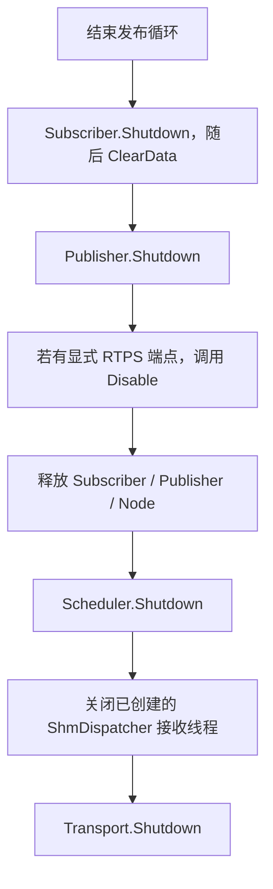
```mermaid
flowchart TD
    STOP[结束发布循环] --> SUB[Subscriber.Shutdown，随后 ClearData]
    SUB --> PUB[Publisher.Shutdown]
    PUB --> EXPLICIT[若有显式 RTPS 端点，调用 Disable]
    EXPLICIT --> OBJ[释放 Subscriber / Publisher / Node]
    OBJ --> SCH[Scheduler.Shutdown]
    SCH --> SHM[关闭已创建的 ShmDispatcher 接收线程]
    SHM --> TRANS[Transport.Shutdown]
```

应用若还使用 TaskManager、SysMo、独立拓扑监听等资源，应另行安排其停止和清理，
并保证依赖调度器的任务先于调度器停止。最终销毁 Publisher、Transport 或 Participant 前，
必须确保发布调用和可能访问它们的拓扑回调已经停止。
Signal 的 Disconnect 不等待已经进入的回调结束；不能仅凭“监听已断开”就立即销毁回调访问的对象。
完整支持范围见 [生命周期与并发边界](../README.md#发送端生命周期与并发边界)。

## 源码阅读路线与验证入口

按下列顺序阅读，可以从应用入口逐步追到线程和内存实现：

| 想追踪的问题 | 建议路线 |
| --- | --- |
| Node 怎样把各层接起来 | [init.cpp](../init.cpp) → [node.cpp](../node/node.cpp) → [node_channel_impl.h](../node/node_channel_impl.h) → Publisher / Subscriber |
| 对端加入后为什么能发送 | [发现与拓扑](topology.md) → ChannelManager → Pub/Sub 的 OnChannelChange → Hybrid 的 Enable/Disable |
| 普通消息怎样跨进程 | [通信流程](transport.md) → Transmitter → Segment/Notifier 或 DDS → Dispatcher → ReceiverManager |
| 自定义类型怎样编码 | [序列化](serialize.md) → [data_stream.h](../serialize/data_stream.h) → [serializable.h](../serialize/serializable.h) |
| 用户回调为什么会执行 | DataDispatcher → DataNotifier → [调度器](scheduler.md) → [协程](croutine.md) → DataVisitor.TryFetch |
| Loan 为什么不能立刻复用 | LoanedMessage → 写/读 Lease → Segment / Block → 缓存及用户持有的共享引用 |
| 怎样构建与检查行为 | [测试与性能程序](../example/TESTING.md)、[Fast DDS 环境](fastrtps.md)、[example/Makefile](../example/Makefile) |
| 哪些场景实际执行过 | [测试记录](../example/testlog.md)；区分同机、跨进程、强制 RTPS 和真实跨主机验证 |

架构图描述源码中的关系与执行路径，不代表每条路径都已有相同程度的验证。
测试能力和运行方法由 TESTING 维护，实际命令与结果由 testlog 维护；本文不把图中的 RTPS 分支当作真实跨主机测试证据。
