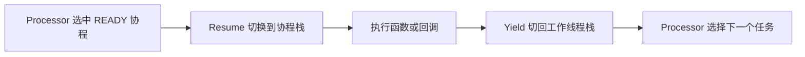

# 协程：挂起与恢复

这里的协程是用户态、带独立栈的执行单元。多个协程由调度器分配到工作线程；它们通过 Yield 主动让出执行权，不会自动获得一个独立线程。
先了解 [调度器](scheduler.md)，再看本页的上下文切换。

## 一次执行的过程

| 接口 | 作用 |
| --- | --- |
| `Resume()` | 从工作线程恢复 READY 协程；停止请求后返回 FINISHED |
| `CRoutine::Yield()` | 在协程内让出执行权 |
| `Yield(state)` | 设置状态后让出执行权 |
| `Wake()` / `SetUpdateFlag()` | 配合状态机使等待中的任务可再次被检查 |
| `Stop()` | 设置停止请求，不抢占当前正在执行的函数 |
| `Acquire()` / `Release()` | 让调度器保证同一时刻只由一个执行者持有协程 |

## 状态怎么变化

| 状态 | 意义 | 后续处理 |
| --- | --- | --- |
| READY | 可以运行 | Processor 可选中并 Resume |
| DATA_WAIT | 等待数据 | DataVisitor 通知后重新检查 |
| IO_WAIT | 等待外部事件 | 由相应通知或唤醒逻辑推进 |
| SLEEP | 等待唤醒时刻 | 调度时检查时间 |
| FINISHED | 函数结束或协程已停止 | 不再执行业务函数 |

不能直接 Resume 一个等待态协程并假定它会运行。业务层一般使用 Subscriber 或 Scheduler 的接口，由它们负责状态和通知。

## 上下文保存在哪里

[RoutineContext](../croutine/croutine_context.h) 保存栈空间和栈指针；当前每个栈预留 2 MiB。
[MakeContext](../croutine/croutine_context.cpp) 建立入口，`SwapContext` 调用汇编切换栈和必要寄存器。
仓库当前有 [x86_64 汇编实现](../croutine/swap_x86_64.S)；头文件中的其他架构分支不能代替实际构建验证。

CRoutine 的上下文通常从对象池获取，池大小参考全局 `routine_num`；超过池容量会告警并另行分配，不能将它视为硬任务上限。
`current_routine_` 和工作线程主栈指针是 `thread_local`，每个工作线程各自维护。

## Subscriber 如何使用协程

[CreateRoutineFactory](../croutine/croutine_factory.h) 的单消息版本反复执行：

1. 将当前协程设为 DATA_WAIT，尝试从 DataVisitor 取消息。
2. 有消息时调用用户回调，回调返回后释放工厂自己的消息引用。
3. Yield 回到调度器；没有消息时等待后续通知。

因此用户回调应及时返回。`std::this_thread::sleep_for` 或阻塞 I/O 会阻塞整个工作线程，不只是当前协程。

## 退出与资源管理

挂起协程被 Stop/移除时，栈可能直接回收，不等同于沿所有 C++ 栈帧正常返回。
不要假设每个挂起位置上的局部 RAII 对象都会自动析构。
单消息工厂在 Yield 前释放消息引用，避免把 Loan/Lease 留在被回收的栈上；多消息工厂应逐处核对，不能外推同样行为。
用户保存的 `shared_ptr` 仍由用户管理，裸指针不能比消息引用活得更久。

退出顺序和并发边界见 [README](../README.md#发送端生命周期与并发边界)；Demo 的完整收尾代码见 [demo_transport.cpp](../example/demo/demo_transport.cpp)。

## 阅读与验证入口

源码顺序：[croutine.h](../croutine/croutine.h) 的状态与操作 → [croutine.cpp](../croutine/croutine.cpp) 的构造/Resume → [上下文](../croutine/croutine_context.cpp) → [Processor](../scheduler/processor.cpp)。

想实际观察回调，运行 `./example/demo/run_demo.sh A`（仓库根目录）。
旧 `test_croutine` 是手工状态检查，不属于正式 `check`；正式测试范围和构建方法见 [TESTING](../example/TESTING.md)。
