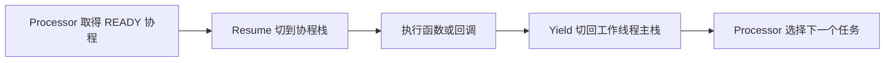
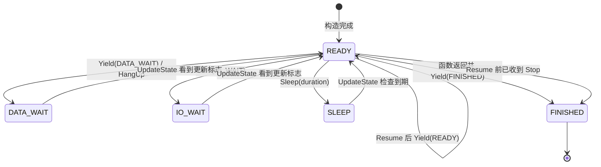

# 协程：挂起与恢复

CRoutine 是带独立栈的用户态执行单元，由 Scheduler 的 Processor 工作线程恢复。它没有独立线程，
也不会被定时器抢占；代码必须通过 `Yield` 主动让出执行权。

## 一次执行的过程

| 接口 | 作用 |
| --- | --- |
| `Resume()` | 只恢复 READY 协程；已收到 Stop 时转为 FINISHED |
| `CRoutine::Yield()` | 保留当前状态并返回 Processor |
| `Yield(state)` | 写入新状态后返回 Processor |
| `HangUp()` / `Sleep()` | 进入 DATA_WAIT / SLEEP 后 Yield |
| `SetUpdateFlag()` | 记录外部事件，供 `UpdateState()` 将等待态转回 READY |
| `Stop()` | 原子设置停止请求，不抢占正在执行的函数 |
| `Acquire()` / `Release()` | 保证同一协程同一时刻只有一个执行者 |

## 状态和通知

| 状态 | 含义 |
| --- | --- |
| READY | 可被 Processor 选择 |
| DATA_WAIT | 等待 DataVisitor 数据 |
| IO_WAIT | 等待外部事件 |
| SLEEP | 等待 steady-clock 唤醒时间 |
| FINISHED | 函数返回或停止请求在 Resume 前生效 |

图中的 Stop 只表示“下一次 Resume 前已经设置停止标志”。Stop 本身不会抢占正在运行的函数，也不会
立即把 DATA_WAIT、IO_WAIT 或 SLEEP 改为 FINISHED；移除路径可能直接等待执行者释放后回收协程。
`Wake()` 可直接写 READY，但 Subscriber 的正常数据通知走更新标志，再由 `UpdateState()` 完成等待态转换。

`state_` 和 `force_stop_` 是 acquire/release 原子量，调度器可并发读取状态或请求停止。
通知使用独立原子更新标志：Scheduler 对每次通知无条件 `SetUpdateFlag()`，`UpdateState()` 消费该标志。
因此事件先于 READY→DATA_WAIT 状态切换到达时，协程仍会在下一轮恢复为 READY。

这套同步只用于调度状态。名称、优先级、组名、唤醒时间和用户捕获的数据不是通用并发容器；应在任务
发布前完成配置，并为业务共享状态另行加锁。不要直接 Resume 等待态协程，通常应调用 Scheduler 或
Subscriber 提供的通知路径。

## 上下文和平台

[RoutineContext](../croutine/croutine_context.h) 保存栈空间和栈指针，每个栈当前预留 2 MiB。
[MakeContext](../croutine/croutine_context.cpp) 建立入口，`SwapContext` 由汇编保存和恢复寄存器。
仓库当前提供 [x86_64 实现](../croutine/swap_x86_64.S)；其他架构的头文件分支不等于已有可用汇编，
移植到 ARM 或嵌入式 Linux 时必须补实现并验证 ABI、栈对齐和寄存器保存集合。

上下文通常来自 `routine_num` 大小的对象池。池耗尽时会告警并单独分配，所以该值是预分配容量，
不是硬任务上限。当前协程和 Processor 主栈指针是 `thread_local`，每个工作线程分别维护。

## Subscriber 如何使用协程

[CreateRoutineFactory](../croutine/croutine_factory.h) 的单消息循环先把状态设为 DATA_WAIT，再尝试从
DataVisitor 取消息；成功则执行回调、释放工厂持有的消息引用，并以 READY 状态 Yield；没有数据则
保持等待。先设置等待态再取数据与 Scheduler 的更新标志共同关闭通知窗口。

多消息工厂采用相同调度流程，但当前只有单消息工厂在回调后显式 `reset()` 最后的消息引用。
回调应及时返回；`sleep_for` 和阻塞 I/O 会阻塞 Processor 上的其他协程。

## 退出与资源管理

Stop 不会强制跳出正在执行的函数。函数返回后入口会 Yield(FINISHED)；挂起协程被移除时，独立栈可
直接回收，不保证像普通函数返回那样逐层析构局部 RAII 对象。

因此不要跨 Yield 在栈上长期持有锁、文件描述符或 SHM Loan/Lease。单消息工厂已在 Yield 前释放
自己的消息引用；多消息工厂和自定义协程仍需逐个挂起点检查。用户保存的 `shared_ptr` 由用户负责，
由它派生的裸指针不能活得更久。

调度器的删除、通知和关闭规则见[调度器](scheduler.md)。源码阅读顺序为
[croutine.h](../croutine/croutine.h) → [croutine.cpp](../croutine/croutine.cpp) →
[croutine_context.cpp](../croutine/croutine_context.cpp) → [processor.cpp](../scheduler/processor.cpp)。
验证入口见[测试指南](../example/TESTING.md)。
