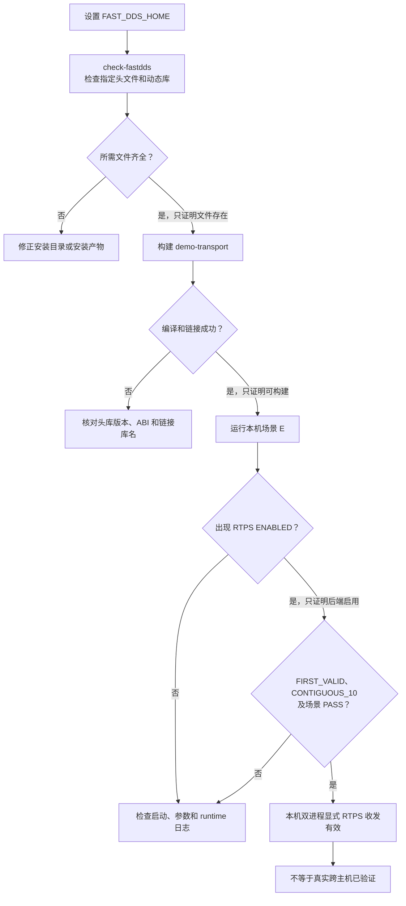

# Fast DDS 环境检查

本仓库通过 Fast DDS 的 **RTPS 层接口**完成发现和 RTPS 消息收发。
本项目的 SHM Segment/Notifier 是另一套实现，不要与 Fast DDS 自带的共享内存传输混为一谈。

## 1. 确认安装目录

现有 Makefile 默认使用 `$HOME/cpp/fastdds_2.12/install`。本地验收使用 Fast DDS 2.12，不能据此保证其他大版本兼容。
在仓库根目录执行：

```bash
export FAST_DDS_HOME="$HOME/cpp/fastdds_2.12/install"
make -C example FAST_DDS_HOME="$FAST_DDS_HOME" check-fastdds
```

将变量值改为自己的安装目录。命令退出 0 只表示所需文件存在，还需要构建和收发验证。

[Makefile](../example/Makefile) 检查以下文件：

```text
include/fastrtps/rtps/RTPSDomain.h
include/fastrtps/rtps/participant/RTPSParticipant.h
lib/libfastrtps.so
lib/libfastcdr.so
lib/libfoonathan_memory-0.7.3.so
```

## 2. 构建并验证

```bash
make -C example -f demo/Makefile -j2 demo-transport
./example/demo/run_demo.sh E --no-build
```

E 是两个本机进程**强制 RTPS**收发。出现 RTPS ENABLED 还不够，需要首条有效消息和场景 PASS。
完整步骤见 [Demo 指南](../example/demo/README.md)。

依赖检查、构建、启动和有效接收是逐层验证关系；任一层成功都不能代替下一层。按下图定位最先失败的层级：



构建会添加 Fast DDS 的 include/lib 路径，并把库目录写入 rpath；通常不需要另设 `LD_LIBRARY_PATH`。
C++14 构建保留 `-faligned-new`，链接还需要 pthread、uuid、rt、atomic、dl；正式测试另外依赖 GoogleTest。

## 3. 常见问题

| 报错或现象 | 处理方法 |
| --- | --- |
| `Missing Fast DDS file` | 检查 `FAST_DDS_HOME` 是否指向安装目录，而不是源码目录 |
| 找不到 `foonathan_memory-0.7.3` | 现有入口链接此库名；核对安装产物，不要随意把其他 ABI 的库改名 |
| 编译提示 API 不匹配 | 检查头文件和库是否来自同一版本，避免混用 ROS 等环境中的依赖 |
| 程序启动找不到 `.so` | 检查编译时目录是否被移动，以及 `ldd example/demo/build/bin/demo_transport` 的输出 |
| 修改依赖路径后仍异常 | 重新构建自己的 Demo 构建目录，避免复用旧对象 |
| 已启用 RTPS 但无有效接收 | 检查两端参数与运行日志；本机强制模式通过不代表跨机器已验证 |

本页以已有安装为前提，不自动安装、升级依赖或修改 shell/系统配置。
RTPS 相关实现可从 [participant.cpp](../transport/rtps/participant.cpp)、[rtps_transmitter.h](../transport/transmitter/rtps_transmitter.h) 和 [rtps_dispatcher.cpp](../transport/dispatcher/rtps_dispatcher.cpp) 开始阅读。
