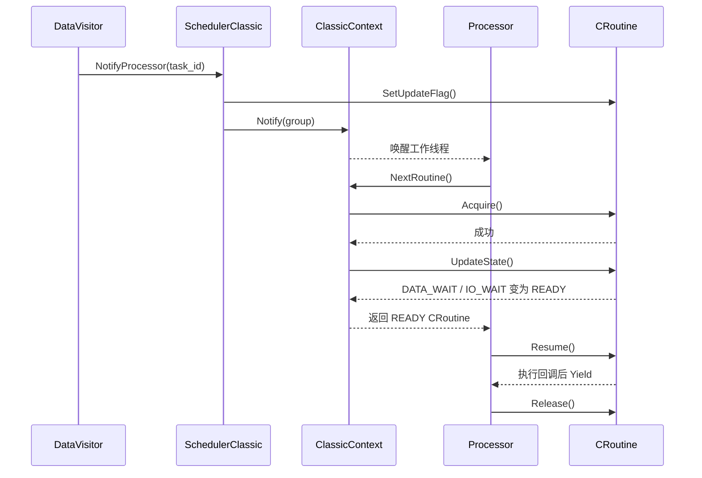

# 调度器：消息回调在哪个线程执行

Subscriber 收到数据后不会在传输线程里直接执行用户回调。DataVisitor 缓存数据并通知任务，
Scheduler 再由 Processor 工作线程恢复 CRoutine。普通 Publisher/Subscriber 用户不需要自己创建
Processor 或 CRoutine。

## 先看执行流程


| 对象 | 职责 | 源码入口 |
| --- | --- | --- |
| Scheduler | 创建、通知、移除任务及整体关闭 | [scheduler.cpp](../scheduler/scheduler.cpp) |
| SchedulerClassic | 分组、优先级和 Processor 创建 | [scheduler_classic.cpp](../scheduler/policy/scheduler_classic.cpp) |
| ClassicContext | 选择 READY 协程，无任务时等待通知 | [classic_context.cpp](../scheduler/policy/classic_context.cpp) |
| Processor | 工作线程、Linux tid 和协程恢复 | [processor.cpp](../scheduler/processor.cpp) |
| CRoutine | 栈、原子状态和协作式切换 | [协程说明](croutine.md) |

工厂当前只有 `classic` 可用。`choreography` 配置名和源码骨架不代表已经接通。

## 怎样选择配置

默认配置适合先跑通。需要专用进程组时，必须在第一次访问调度器或创建 Subscriber 前设置：

```cpp
#include <cmw/common/global_data.h>
#include <cmw/scheduler/scheduler_factory.h>

// 程序已经 Init，CMW_PATH/conf/my_process.conf 使用 classic 配置。
hnu::cmw::common::GlobalData::Instance()->SetProcessGroup("my_process");
auto* scheduler = hnu::cmw::scheduler::Instance();
```

调度器读取 `conf/<进程组>.conf`。找不到时创建默认 classic 分组，线程数来自
`default_proc_num`，未配置则为 2。路径、JSON 字段和默认值见[配置说明](../config/config.md)。

### CPU 和线程策略

| 配置 | 实际行为 |
| --- | --- |
| `cpuset` | 支持 `0,2-4`；空串表示不限制，非法数字、倒序区间和超出 `CPU_SETSIZE` 会失败 |
| `affinity: range` | 每个 Processor 使用整个 CPU 集合 |
| `affinity: 1to1` | 第 `i` 个 Processor 绑定第 `i` 个 CPU；CPU 数不足会失败 |
| `SCHED_FIFO` / `SCHED_RR` | 校验系统允许的实时优先级；通常还需要相应权限 |
| `SCHED_OTHER` | `processor_prio` 表示 nice 值，范围 -20～19；设置指定线程必须使用 Linux tid |

绑核后会回读实际 CPU mask；内核或 cgroup 若缩小 mask，也视为失败。进程绑核、Processor 绑核或
调度策略应用失败时，classic 构造会停止当前 Processor 并抛出异常，不会记录虚假的成功。
`SetInnerThreadAttr(name, thread, tid)` 则以 `bool` 返回结果；`SCHED_OTHER` 的 `tid` 不是
`pthread_t` 或 `std::thread::id`。这些接口依赖 Linux pthread、affinity、nice 语义。

不要直接照搬 [example_sched_classic.conf](../conf/example_sched_classic.conf) 的 CPU 编号和实时策略；
先核对在线 CPU、容器允许的 mask 和进程权限。

## 自定义任务如何接入

| 接口 | 使用要点 |
| --- | --- |
| `CreateTask(func, name)` | 名称须唯一；保存并检查返回值 |
| `CreateTask(factory, name)` | RoutineFactory 可绑定 DataVisitor 和通知回调 |
| `NotifyTask(id)` | 记录一次更新并唤醒所属组，不在调用线程同步执行任务 |
| `RemoveTask(name)` | 请求停止、从注册表移除，并等待正在运行的协程释放执行权 |
| `Shutdown()` | 关闭 Context、移除任务并停止所有 Processor |

每次 Notify 都先清除 CRoutine 的更新标志，再唤醒工作组。即使通知发生在协程从 READY 切到
DATA_WAIT 之前，下一次 `UpdateState()` 仍能看到更新，避免这段窗口丢唤醒。

下面只展示任务仍存在、`Acquire()` 成功且状态检查得到 READY 的一轮。组被唤醒只表示 Processor 会
重新扫描就绪队列，不保证某个目标任务立即执行。



`NotifyProcessor` 只记录更新并唤醒组。ClassicContext 通过 `NextRoutine()` 取得并检查协程，随后
Processor 才调用 `Resume()`；`Acquire()` / `Release()` 只是防止两个 Processor 同时恢复同一协程。

Notify 与 Remove 通过任务映射的读写锁协调，任务创建和移除还使用每任务互斥。Remove 不能抢占正在
执行的用户函数；回调若不返回或不 Yield，Remove 和 Shutdown 可能一直等待。不要从任务内部同步
移除它自己。

## 调度规则与限制

- classic 优先级范围为 0～19，数值越大越先检查；更大的值会限制到 19。
- `Acquire()` 保证同一 CRoutine 不会被多个 Processor 同时恢复。
- 调度是协作式的。阻塞 I/O、长计算或 `sleep_for` 会占住整个 Processor 线程。
- 优先级不提供实时、公平或固定延迟保证；OS 实时策略也不能替代任务主动 Yield。
- CRoutine 的原子状态只覆盖调度协议，业务对象仍需自己的同步。
- 挂起协程停止时不保证展开 C++ 栈，资源边界见[退出与资源管理](croutine.md#退出与资源管理)。

## 怎样验证或排查

正式入口和命令见[测试指南](../example/TESTING.md)。`test_scheduler`、`test_croutine` 是旧手工程序，
不能仅凭退出码外推完整并发正确性。

| 现象 | 优先检查 |
| --- | --- |
| 提示使用默认 scheduler conf | `CMW_PATH`、进程组名和 JSON 路径 |
| CreateTask 返回 false | Scheduler 是否关闭、名称是否重复 |
| 收到数据却没有回调 | 任务是否被移除、回调是否阻塞、DataVisitor 是否仍存活 |
| 关闭一直等待 | 当前回调是否长期运行且没有返回/Yield |
| 绑核或策略异常 | cpuset 语法、cgroup mask、Linux tid、实时权限与优先级范围 |
