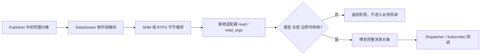

# 定义消息与序列化

普通消息经 SHM 或 RTPS 发送前由 `DataStream` 编码，接收端按相同字段顺序解码。INTRA 共享对象，
纯 SHM Loan 使用专用字节缓冲，不走这条普通序列化路径。

## 一个完整的稳定 Schema 定义

类型需要同时定义字段编码和跨进程稳定身份。下面的类型可直接用于
`Node::CreatePublisher<DemoMessage>` 与 `CreateSubscriber<DemoMessage>`：

```cpp
#include <cstdint>
#include <string>

#include <cmw/config/message_type.h>
#include <cmw/serialize/data_stream.h>

using hnu::cmw::serialize::DataStream;

struct DemoMessage : public hnu::cmw::serialize::Serializable {
  uint64_t sequence = 0;
  std::string payload;

  SERIALIZE(sequence, payload)
};

namespace hnu {
namespace cmw {
namespace config {

template <>
struct MessageTypeTrait<::DemoMessage> {
  static const char* Name() { return "demo.telemetry"; }
  static uint32_t Version() { return 1; }
};

}  // namespace config
}  // namespace cmw
}  // namespace hnu
```

该 Trait 生成 `cmw.schema/demo.telemetry@1`。通信两端必须使用相同名称、版本、字段类型和字段顺序。
改变字段的编码含义时提升版本，并一起升级所有进程；相同名称和版本不会自动证明两份 C++ 定义兼容。

特化时须提供 `Name()` 和 `Version()` 两个方法；名称有效但版本为 0，或版本非零但名称为空时，
会得到空标识，端点初始化失败。
未特化 Trait 时，显式填写的 `RoleAttributes::message_type` 作为旧式标识保留；也未填写时，系统使用带
编译器标签的 `cmw.abi/...` 签名。ABI fallback 只适合同一编译器和兼容构建，不能作为稳定协议名称。
类型标识的实现见 [message_type.h](../config/message_type.h)。

```mermaid
flowchart TD
    T[消息类型 T] --> M[MessageTypeIdentifier]
    M --> A{Trait 名称和版本}
    A -->|两者有效| S[cmw.schema/name@version]
    A -->|一项有效，另一项无效| X[空标识，端点初始化失败]
    A -->|两者都未设置| L{RoleAttributes 有显式标识?}
    L -->|是| G[保留 legacy 标识]
    L -->|否| B[生成 cmw.abi/编译器/类型签名]
    S --> C[Discovery 与 HYBRID 精确比较标识]
    G --> C
    B --> C
```

Schema 标识回答“通信双方是否声明同一版本”，DataStream 校验回答“收到的字节能否按该定义安全解码”。
两者用途不同，任何一项都不提供字段迁移或版本转换。

## 编码和解码

`SERIALIZE(...)` 按参数顺序写入字段。不要序列化进程指针、mutex 或对象内存布局；容器会逐元素编码，
不是直接复制连续内存。

```cpp
bool RoundTrip() {
  DemoMessage sent;
  sent.sequence = 1;
  sent.payload = "hello";

  hnu::cmw::serialize::DataStream bytes;
  bytes << sent;
  hnu::cmw::serialize::DataStream input(bytes.data(), bytes.size());

  DemoMessage received;
  return input.read(received) &&
         received.sequence == sent.sequence &&
         received.payload == sent.payload;
}
```

`operator >>` 返回流引用；需要判断错误时使用返回 `bool` 的 `read()` 或 `read_args()`。读取失败会保持
失败状态并把位置回退到本次读取起点；`reset()` 重置读位置和失败状态，`clear()` 还会清空缓冲区。

| 类型 | Wire 规则 |
| --- | --- |
| bool、整数、浮点数 | 类型标记和值；读取用 `memcpy`，不依赖未对齐指针 |
| string | 类型标记、长度和字节 |
| vector/list/set | 类型标记、元素数量和逐项编码 |
| map | 类型标记、元素数量和逐对编码 |
| 自定义类型 | CUSTOM 标记和 `SERIALIZE(...)` 指定的字段 |

读取端会检查类型、剩余字节、容器长度和嵌套字段结果；截断或非法长度返回失败，并尽量保留目标容器
原值。这些检查不验证业务语义，枚举范围、序号和内容仍由应用检查。



INTRA 直接共享对象引用，纯 SHM Loan 交付只读 View，因此不经过上图的 DataStream 编解码。

源码入口：[serializable.h](../serialize/serializable.h) 定义宏，
[data_stream.h](../serialize/data_stream.h) 实现容器模板，
[data_stream.cpp](../serialize/data_stream.cpp) 实现基础类型和边界检查。可运行示例见
[demo_transport.cpp](../example/demo/demo_transport.cpp)，测试方法见[测试指南](../example/TESTING.md)。
