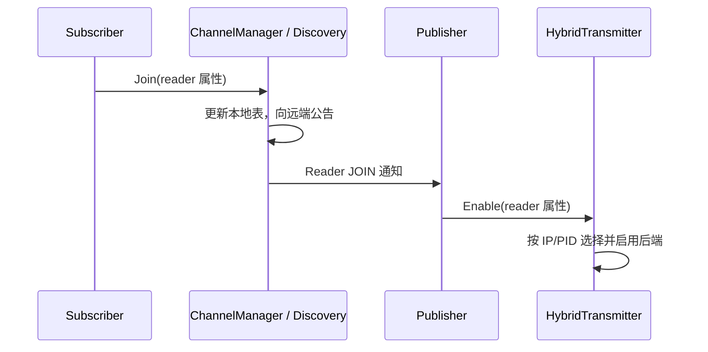

# Discovery 与拓扑

Discovery 负责回答“谁在发布、谁在订阅”。Publisher/Subscriber 根据这些信息启停通信路径。
先运行 `./example/demo/run_demo.sh B`，观察 MATCHED、SHM ENABLED 和 FIRST_VALID，再读下面的流程。
命令在仓库根目录执行；环境要求见 [Demo 指南](../example/demo/README.md)。

## 一次订阅如何建立



接收端也需要 Publisher 的属性：收到 Writer JOIN 后，HybridReceiver 才把 listener 注册到对应接收后端。
**发现了订阅者不等于消息已送达**，仍须检查首条有效接收。

## 先认清几个名称

| 名称 | 表示什么 | 源码 |
| --- | --- | --- |
| Node | 应用节点，可创建多个发布/订阅端 | [node.h](../node/node.h) |
| Writer / Reader | 拓扑中对 Publisher / Subscriber 的称呼 | [role.h](../discovery/role/role.h) |
| RoleAttributes | channel、节点、IP、PID、endpoint id、消息类型与 QoS | [RoleAttributes.h](../config/RoleAttributes.h) |
| ChangeMsg | 谁在什么时候 JOIN/LEAVE | [topology_change.h](../config/topology_change.h) |
| TopologyManager | 创建发现通信、管理节点和频道管理器、处理参与者离线 | [topology_manager.cpp](../discovery/topology_manager.cpp) |
| ChannelManager | 保存频道的发布/订阅关系，并发出变更通知 | [channel_manager.cpp](../discovery/specific_manager/channel_manager.cpp) |

`channel_id` 标识频道，`id` 标识端点，两者不能互换。每个 Subscriber 有自己的端点 ID，同一频道的多个订阅者可以被分别移除。

## 怎样查询和监听

应用已有 Publisher 时，优先使用：

```cpp
std::vector<hnu::cmw::config::RoleAttributes> peers;
publisher->GetSubscribers(&peers);
const bool has_subscriber = publisher->HasSubscriber();
```

上面的 `publisher` 是已初始化的 `Publisher<MessageT>` 指针。查询只反映当前已发现的关系，不是发送确认。

需要更细的信息时，使用 `TopologyManager::Instance()->channel_manager()`：

| 接口 | 用途 |
| --- | --- |
| `GetReadersOfChannel` / `GetWritersOfChannel` | 查询频道当前端点 |
| `GetReadersOfNode` / `GetWritersOfNode` | 查询节点端点 |
| `GetUpstreamOfNode` / `GetDownstreamOfNode` | 查询节点上下游 |
| `GetFlowDirection` | 查询节点间数据流向 |
| `AddChangeListener` / `RemoveChangeListener` | 订阅/注销频道端点变更 |

监听回调应按 `channel_name` 和 `role_type` 过滤。保存返回的连接，在捕获对象销毁前注销；注销不保证已经开始的回调全部结束。
普通应用让 Node 管理 JOIN/LEAVE 即可；直接调用管理器要自己保证属性、身份和对象生命周期一致。

## 订阅者退出和重新加入

1. Subscriber 正常 `Shutdown()`，从拓扑发送 Reader LEAVE。
2. Publisher 收到真实 LEAVE 后移除该 peer；只有最后一个同模式 peer 离开，才关闭对应发送后端。
3. 新 Reader JOIN 后可重新启用后端。接收方还必须获得 Writer 信息，才能安装接收 listener。

Discovery 的底层端点与公告 QoS 均采用 `RELIABLE + TRANSIENT_LOCAL`。
全新订阅进程可读取仍在线发布端保留的 Writer JOIN；Demo D 已去掉应用层重新公告。
这恢复的是后续消息接收，不包含离线补发。[修复范围](../README.md#discovery-后启动进程发现)；
[恢复操作](../example/demo/README.md#5-实现要点与验证边界)。

## 想继续读源码

按这个顺序阅读，避免从容器实现开始：

1. [publisher.h](../node/publisher.h)、[subscriber.h](../node/subscriber.h)：注册、查询和处理对端变化。
2. [manager.cpp](../discovery/specific_manager/manager.cpp)：JOIN/LEAVE 的本地处理与远端公告。
3. [channel_manager.cpp](../discovery/specific_manager/channel_manager.cpp)：维护按 node/channel 索引的端点表和节点图。
4. [container/](../discovery/container/)：SingleValueWarehouse 保存单值，MultiValueWarehouse 保存多值，Graph 保存节点连接。
5. [transport_mode.h](../config/transport_mode.h)：真实自动选路规则。

拓扑通知按实际序列化长度申请 DDS 缓冲。公告发送失败不会回滚已更新的本地表，详见 [接口边界](../README.md#discovery-拓扑通知容量)。
验证入口见 [集成测试](../example/TESTING.md#测试覆盖)；历史结果见 [testlog](../example/testlog.md)。
