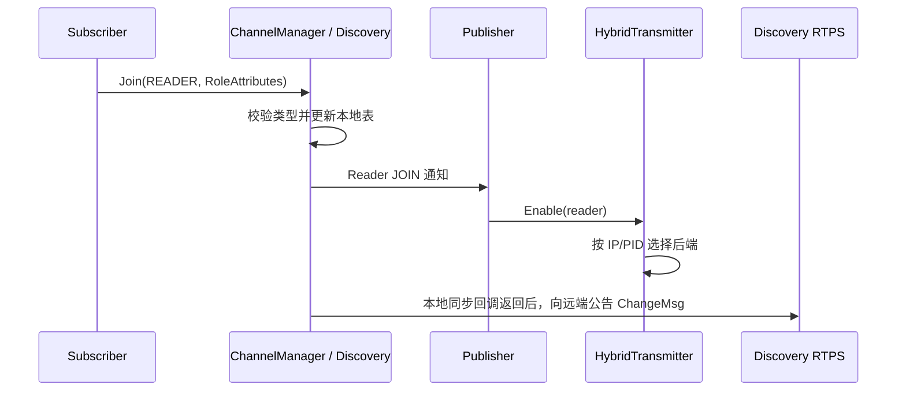
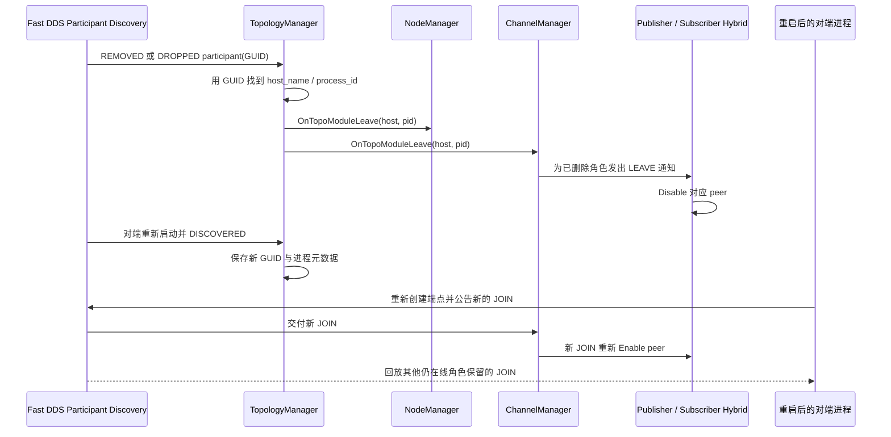

# Discovery 与拓扑

Discovery 回答“谁在发布、谁在订阅”，Publisher/Subscriber 再根据这些信息启停通信路径。
它负责控制面，不承载业务 Payload。

## 一次订阅如何建立



接收端也必须取得 Writer 属性，HybridReceiver 才会注册对应 peer 的接收 listener。发现匹配只表示
通信路径具备启用条件，不表示消息已经送达。

## 先认清几个名称

| 名称 | 含义 | 源码 |
| --- | --- | --- |
| Node | 应用节点，可创建多个发布/订阅端点 | [node.h](../node/node.h) |
| Writer / Reader | 拓扑中对 Publisher / Subscriber 的称呼 | [role.h](../discovery/role/role.h) |
| RoleAttributes | channel、节点、IP、PID、endpoint id、消息类型和 QoS | [RoleAttributes.h](../config/RoleAttributes.h) |
| ChangeMsg | 一个角色的 JOIN/LEAVE 公告 | [topology_change.h](../config/topology_change.h) |
| TopologyManager | 管理发现 Participant、NodeManager、ChannelManager 和参与者离线 | [topology_manager.cpp](../discovery/topology_manager.cpp) |
| ChannelManager | 保存端点索引与节点关系，并通知监听者 | [channel_manager.cpp](../discovery/specific_manager/channel_manager.cpp) |

`channel_id` 标识频道，`id` 标识端点。每个 Subscriber 有独立端点 ID，同频道多个 Reader 可分别移除。
同一频道的消息类型在入表前原子检查；冲突或空类型不会入表、通知或继续广播。

## 怎样查询和监听

已有 Publisher 时优先使用：

```cpp
std::vector<hnu::cmw::config::RoleAttributes> peers;
publisher->GetSubscribers(&peers);
const bool has_subscriber = publisher->HasSubscriber();
```

查询只反映当前已发现关系，不是发送确认。需要图关系或原始变化时，可从
`TopologyManager::Instance()->channel_manager()` 取得管理器：

| 接口 | 用途 |
| --- | --- |
| `GetReadersOfChannel/GetWritersOfChannel` | 查询频道端点 |
| `GetReadersOfNode/GetWritersOfNode` | 查询节点端点 |
| `GetUpstreamOfNode/GetDownstreamOfNode` | 查询节点上下游 |
| `GetFlowDirection` | 查询节点间数据方向 |
| `AddChangeListener/RemoveChangeListener` | 订阅或注销端点变化 |

先检查 `TopologyManager::IsInitialized()` 和返回的 shared_ptr 是否为空。普通应用让 Node 管理
JOIN/LEAVE；直接调用 Manager 时，调用者须保证属性、身份和生命周期一致。

监听回调应过滤 channel 和 role，并在捕获对象销毁前注销。注销不是在飞回调的完成屏障；
TopologyManager 的整体 Shutdown 才会先停止并等待自己的 Discovery listener。

## 订阅者退出和重新加入

1. Subscriber 正常关闭并发布 Reader LEAVE。
2. Publisher 删除对应 peer；最后一个同模式 peer 离开后关闭该发送后端。
3. 新 Reader JOIN 后重新启用发送端；接收方取得 Writer 信息后重新安装接收 peer。

进程异常离线没有机会主动发送每个角色的 LEAVE，此时由 Participant 发现事件触发整批清理：



正常显式 LEAVE 精确删除一个 endpoint；Participant 离线按 host/PID 清理该进程留下的节点和角色。
对端重启通常具有新的 PID 或 GUID，恢复依赖新一轮 Participant 发现及拓扑公告，不能复用旧 endpoint 身份。
新 JOIN 公告与历史接收可以交错；图只说明拓扑清理与发现，不代表崩溃后所有通信资源都能自动恢复。

Manager 先更新本地表，再发送公告；公告失败不会回滚已经生效的本地变更。被消息类型检查拒绝的变更
不会通知或发送。Reader LEAVE 会同步清理按 node 和 channel 保存的索引。

Discovery 使用 `RELIABLE + TRANSIENT_LOCAL` 和独立的历史容量，后启动进程可读取仍在线角色的公告。
它不会补发离线期间的业务消息。KEEP_ALL 容量耗尽后也没有自动全量状态重建，具体约定见
[README 的 QoS 边界](../README.md#qos-配置与执行边界)。

TopologyManager 初始化失败会回收已经创建的 Writer、Reader、history、listener 和 Participant，
`CreateNode()` 因此返回空指针；修复环境后可调用 `Init()` 重试。显式 Shutdown 会阻止并发的生命周期
切换，等待在飞发现回调，再按依赖顺序释放资源；它是幂等的，之后可重新 Init。单个 Manager 的
Shutdown 则是终止操作，不支持重启。重新初始化前应释放旧 Node/端点，外部拓扑监听也要重新注册。

生命周期切换不能从 Fast DDS listener 回调内部重入。Participant 暴露的 Fast DDS raw pointer 是
借用引用，不能与 Shutdown 并发长期持有。

## 想继续读源码

1. [publisher.h](../node/publisher.h)、[subscriber.h](../node/subscriber.h)：注册、查询并处理对端变化。
2. [manager.cpp](../discovery/specific_manager/manager.cpp)：生命周期、JOIN/LEAVE 和远端公告。
3. [channel_manager.cpp](../discovery/specific_manager/channel_manager.cpp)：类型校验、端点索引和关系图。
4. [topology_manager.cpp](../discovery/topology_manager.cpp)：初始化回滚、Participant 离线与显式关闭。
5. [transport_mode.h](../config/transport_mode.h)：IP/PID 自动选路规则。

运行方法见[测试指南](../example/TESTING.md)，实际结果见[测试记录](../example/testlog.md)。
