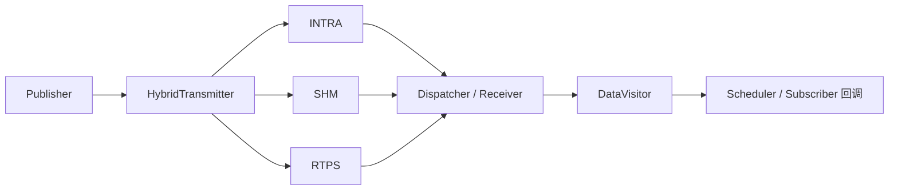
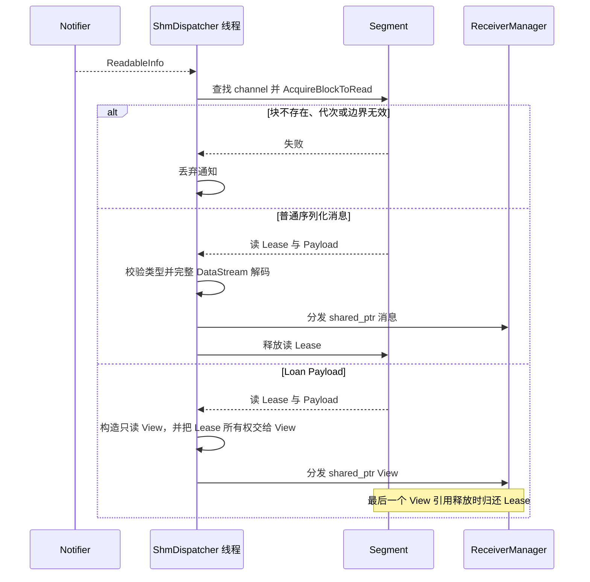

# 通信流程

Transport 负责把业务消息送到订阅端。普通应用使用 Node 的 Publisher/Subscriber；只有需要明确指定
后端时才直接调用 Transport。完整规格见 [README](../README.md#功能与使用边界)。

## 一条消息经过哪些层

Discovery 提供对端 IP、PID 和消息类型，Hybrid 据此选路；Discovery 不承载业务 Payload。

| 双方关系 | 自动后端 | 普通消息的数据处理 |
| --- | --- | --- |
| 同 IP、同 PID | INTRA | 传递原始 `shared_ptr` |
| 同 IP、不同 PID | SHM | 序列化到共享 Block，以通知定位并在接收端解码 |
| 不同 IP | RTPS | 序列化到 Fast DDS Writer，Reader 收到后解码 |

每种活跃后端发送一次，同模式多个订阅者不会重复发送。多种位置的订阅者可让多条路径同时活跃。
默认 HYBRID 等待发现关系；显式 INTRA/SHM/RTPS 端点直接尝试启用。发送失败时不会自动换后端重发或内部重试。
SHM 和 RTPS 的普通消息分发都会检查完整解码结果，非法或截断输入不会进入业务回调。

## 按层找接口

| 目的 | 接口 / 源码 |
| --- | --- |
| 创建业务端点 | [Node](../node/node.h) |
| 发布普通消息 | [Publisher::Publish](../node/publisher.h) |
| 查询已发现订阅者 | `Publisher::GetSubscribers/HasSubscriber` |
| 明确选择后端 | [Transport](../transport/transport.h) 的 `OptionalMode` |
| 查看自动选路 | [SelectMode](../config/transport_mode.h) |
| 查看后端启停 | [HybridTransmitter](../transport/transmitter/hybrid_transmitter.h)、[HybridReceiver](../transport/receiver/hybrid_receiver.h) |
| 查看接收分发 | [dispatcher](../transport/dispatcher/)、[Subscriber](../node/subscriber.h) |

Node 没有模式参数。直接调用 Transport 也不会自动创建 Node 的发现关系；强制 RTPS 示例只能证明
指定后端通信，不能替代真实跨主机自动选路验证。

## SHM 中保存了什么

| 对象 | 作用 |
| --- | --- |
| Segment / Block | 保存 Payload、长度、类型、generation 和读写状态 |
| ReadableInfo | 记录 host、channel、block index 和 generation |
| Notifier | 广播块位置，不携带完整 Payload |
| Block Lease | 保持映射及块的读写所有权，析构时归还 |

普通 SHM 消息经过 DataStream。纯 SHM Loan 可直接填充借出的 Block，接收端 View 持有读 Lease，
避免中间 Payload 复制。通知发出前写 Lease 已释放，慢读者取得读 Lease 前块可能已被复用；
generation 用于拒绝过期通知。Notifier 是有界广播环，通知成功不保证每个读者最终取得数据。

接收端在拿到通知后才申请读 Lease，并根据 Payload 类型走普通解码或 Loan View：

这也解释了两类失败：通知到达不代表对应 generation 仍在；View 尚被缓存或用户持有时，对应块不能复用。

布局、容量和 Loan 所有权见 [README](../README.md#共享区布局-v3-与兼容性)及
[测试指南中的通信 Demo](../example/TESTING.md#面试通信-demo)。

## 启停时必须注意

- 最后一个同模式 peer 离开后才停用发送后端；后续 JOIN 可以重新启用。
- `Publish()==true` 不等于接收确认；普通 Hybrid 无订阅者也可能返回 true。
- Loan 无路由时失败；旧 SHM Loan 在后端重启后失效。
- 一次多路径发送可能部分成功但整体返回 false，已投递消息不会回滚。
- 支持一个发布线程与后端 Enable/Disable 并发；多发布线程和边析构边发布不在支持范围。
- 关闭前应结束业务调用和拓扑回调，再销毁 Publisher、Transport 或 Participant。

Discovery Participant 的创建失败会向上返回；显式关闭会等待在飞 Discovery 回调后再释放 listener。
生命周期切换须从 listener 回调之外的控制线程发起。详细同步规则见
[README](../README.md#发送端生命周期与并发边界)。

## 排查收不到消息

1. 检查两端 channel、消息类型和 QoS 是否兼容。
2. 检查 Publisher 是否发现 Reader，Subscriber 是否发现 Writer。
3. 检查实际后端是否启用，以及共享区、容量或 Fast DDS 错误。
4. 检查接收端是否通过边界和解码校验，再检查 DataVisitor 与调度任务。

可按[测试指南](../example/TESTING.md#面试通信-demo)运行通信 Demo；测试范围和历史结果分别见
[测试指南](../example/TESTING.md)与[测试记录](../example/testlog.md)。
