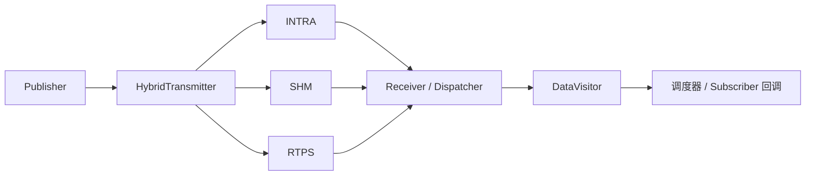

# 通信流程

Transport 把一条业务消息送到订阅端。普通应用使用 Node 的 Publisher/Subscriber；需要指定后端时才直接使用 Transport。

先在仓库根目录运行：

```bash
./example/demo/run_demo.sh
```

A～E 会展示 INTRA、SHM、Loan/View、退出恢复和同机强制 RTPS。[单场景与手动操作](../example/demo/README.md)。

## 一条消息经过哪些层



Discovery 向 Hybrid 提供对端 IP/PID；这一步负责选路，不承载业务 Payload。
[发现过程](topology.md) 与数据传输是两个需要分别确认的环节。

| 双方关系 | 自动后端 | 普通消息的数据处理 |
| --- | --- | --- |
| 同 IP、同 PID | INTRA | 将原始 `shared_ptr` 交给进程内 Dispatcher |
| 同 IP、不同 PID | SHM | 序列化、写入共享 Block、发送通知；接收端读取并反序列化 |
| 不同 IP | RTPS | 序列化后交给 Fast DDS Writer；Reader 收到后反序列化 |

每种活跃后端发送一次。同模式多个订阅者不重复写入，跨位置订阅者可以使多条后端同时工作。
默认 HYBRID 等待发现关系；显式 INTRA/SHM/RTPS 创建后立即尝试启用。没有失败自动切换或内部重试。

## 按层找接口

| 想做什么 | 接口 / 位置 |
| --- | --- |
| 创建业务收发端 | [Node::CreatePublisher/CreateSubscriber](../node/node.h) |
| 发普通消息 | [Publisher::Publish](../node/publisher.h)，可传消息或 `shared_ptr` |
| 查订阅者 | `Publisher::GetSubscribers/HasSubscriber` |
| 明确选择后端 | [Transport::CreateTransmitter/CreateReceiver](../transport/transport.h) 的 `OptionalMode` 参数 |
| 查看选路 | [SelectMode](../config/transport_mode.h) |
| 查看启停 | [HybridTransmitter](../transport/transmitter/hybrid_transmitter.h)、[HybridReceiver](../transport/receiver/hybrid_receiver.h) |
| 查看接收分发 | [dispatcher/](../transport/dispatcher/)、[Subscriber](../node/subscriber.h) |

Node 没有模式参数；直接调用 Transport 时也不会替你创建 Node 的发现关系。
可参考 [Demo E](../example/demo/demo_transport.cpp) 的显式 RTPS 用法，不能把强制后端说成自动选路。

## SHM 中保存了什么

| 对象 | 作用 |
| --- | --- |
| Segment | 一个频道的共享数据段；默认 POSIX，XSI 供独立测试使用 |
| State / Block | 共享段状态与每个数据块的长度、类型、读写状态等元数据 |
| Payload buffer | 真正的消息字节 |
| ReadableInfo | 通知中的 host、channel、block index、generation，帮助接收端定位数据 |
| Notifier | 广播“哪个块有新消息”，不携带完整 Payload |
| Writable/ReadableBlockLease | 保持映射和块读写所有权，释放时归还 |

发送端提交数据后发布通知；接收端按 channel 找到 Segment，再校验块代次并读取。
通知成功不保证所有读者收到，也不保证慢读者处理时旧块仍可读。

普通 SHM 经过 `DataStream`。纯 SHM Loan 则直接在借出的 Block 填充数据，接收端持有只读 View，避免中间 Payload 拷贝。
关键调用与生命周期见 [Loan/View](../example/demo/README.md#loanview-到底省了哪次拷贝)。

## 启停时必须注意

- 最后一个同模式 peer 离开才停用发送后端；接收端主要注销该 peer 的 listener，channel 资源可以继续复用。
- `Publish()==true` 只表示 API 成功，不能代替接收确认；普通 Hybrid 无订阅者也可返回 true。
- Loan 在无路由时失败，旧 SHM Loan 在后端重启后失效；一次多路发送可能部分送达但整体返回 false。
- 支持一个发布线程与后端启停并发。Publisher/全局对象的关闭必须另行协调，不能边析构边发布。
- Shutdown 前要结束业务调用并回收线程，不能仅靠释放一个局部指针推断所有资源已退出。

锁、epoch、共享区版本、Notifier 丢弃行为的完整约定以 [根 README](../README.md#功能与使用边界) 为准。
运行和清理见 [测试指南](../example/TESTING.md#环境与清理)。

## 排查收不到消息

按“属性 → 匹配 → 后端 → 内容”的顺序检查：

1. 两端 channel、消息类型、Payload 参数是否一致。
2. Publisher 是否真的发现订阅者；新进程是否也获得 Writer 信息。
3. 实际后端是否启用，运行日志是否有共享区布局、容量或 DDS 错误。
4. 接收端是否收到并完整校验消息；不要只查看发送成功数。

Demo 的 `[DISCOVERY]`、`[ROUTE]`、`[CHECK]` 分别对应这几个环节。
同机强制 RTPS 和受控 host 元数据测试都不能证明真实跨机器自动通信。
