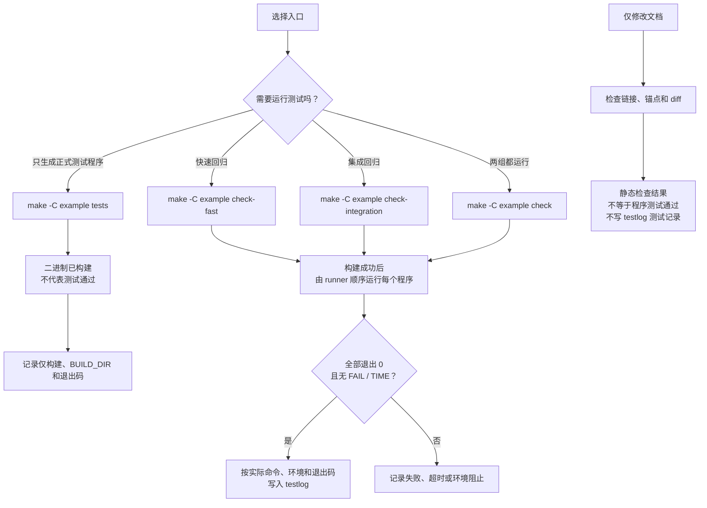

# 构建、测试与性能实验

本页命令均从**仓库根目录**执行，是可复用示例；实际执行记录见 [testlog](testlog.md)。
通信演示见 [Demo 指南](demo/README.md)，Fast DDS 安装检查见 [Fast DDS 环境](../doc/fastrtps.md)。

## 先跑快速回归

准备 Linux、g++、make、GoogleTest 和 Fast DDS，然后执行：

```bash
export CMW_PATH="$PWD"
unshare --user --map-root-user --ipc make -C example -j2 check-fast
```

`unshare` 创建独立 IPC 环境，避免宿主旧通知区干扰；它不隔离网络。宿主禁止 user/IPC namespace 时，
该命令属于环境阻止，不能记为测试通过。runner 逐个执行程序；只有没有 `[FAIL]`、`[TIME]` 且整体退出 0 才通过。

## 选择正确的入口

| 命令 | 行为 |
| --- | --- |
| `make -C example -j2` | 构建 publisher、subscriber |
| `make -C example -j2 tests` | 只构建全部正式回归程序 |
| `make -C example -j2 check-fast` | 构建并顺序运行快速回归 |
| `make -C example -j2 check-integration` | 构建并顺序运行集成回归 |
| `make -C example -j2 check` | 先跑 fast，再跑 integration；两组都报告结果 |
| `make -C example BUILD_DIR="$PWD/example/build/benchmark" -j2 benchmarks` | 在独立 benchmark 子目录构建性能程序，不运行 |
| `make -C example -f demo/Makefile -j2 demo-transport` | 构建独立通信 Demo |

普通产物必须放在 `example/build/` 或其子目录；默认二进制在 `example/build/bin/`。
benchmark、sanitizer 或不同优化参数使用独立子目录，不能混用对象。Demo 是唯一例外，使用 `example/demo/build/`。

下面的流程图用于区分“生成程序”“实际运行”和“记录结果”。`tests` 成功只说明构建完成；
`check-fast`、`check-integration` 和 `check` 才会调用 runner 运行程序。纯文档检查也不能作为程序测试证据。



### 只运行一个测试

```bash
export CMW_PATH="$PWD"
make -C example -j2 test_serialize
bash example/run_tests.sh --bin-dir "$PWD/example/build/bin" --timeout 30 test_serialize
```

GoogleTest 过滤条件通过环境变量传入，并在实际记录中保留：

```bash
GTEST_FILTER='DataStreamTest.*' bash example/run_tests.sh \
  --bin-dir "$PWD/example/build/bin" --timeout 30 test_serialize
```

### 超时与日志

`check-fast` 默认每个程序 30 秒，`check-integration` 默认 90 秒：

```bash
CMW_PATH="$PWD" unshare --user --map-root-user --ipc \
  make -C example -j2 CHECK_FAST_TIMEOUT=45 CHECK_INTEGRATION_TIMEOUT=120 check
```

runner 为每个测试建立独立进程组；缺失二进制、非零或信号退出、超时都失败。保存输出时只写根目录 `log/`：

```bash
RUN_DIR=$(mktemp -d "$PWD/log/test-run-XXXXXX")
CMW_PATH="$PWD" bash example/run_tests.sh \
  --bin-dir "$PWD/example/build/bin" --timeout 30 test_serialize \
  > "$RUN_DIR/test.log" 2>&1
```

日志不能替代 testlog 中的完整命令、环境、退出码和结果摘要。

## 测试覆盖

快速回归覆盖以下正式目标：

| 目标 | 主要检查 |
| --- | --- |
| `test_serialize`、`test_qos` | DataStream 边界与失败传播；QoS 默认值、归一化、缓存和慢消费者 |
| `test_blocker`、`test_node`、`test_publisher_subscriber` | 基础 API、观察缓存、同进程消息、类型与初始化失败 |
| `test_transport_mode_selection`、`test_hybrid_intra` | IP/PID 选路；真实 Node/Discovery INTRA 和多 peer 生命周期 |
| `test_shm_segment_robustness`、`test_shm_block_lease_generation` | Segment 布局、Lease、generation、closing 与并发最后引用 |
| `test_shm_dispatcher_robustness`、`test_shm_transmitter_receiver` | SHM 异常输入、超限、重建与恢复 |
| `test_shm_loaned_message`、`test_shm_transmitter_lifecycle_regression`、`test_loaned_message_hybrid` | Loan/View、epoch、只读与启停 |
| `test_intra_transmitter_lifecycle` | 同步重入及发送/启停并发 |
| `test_logger_paths` | 日志目录、追加、轮转和失败处理 |
| `test_queue_regression`、`test_croutine_concurrency`、`test_scheduler_concurrency` | 有界 MPMC、等待终止、协程通知/停止及 Remove 交错 |
| `test_scheduler_attributes` | range/1to1 affinity、nice、实时优先级参数和失败传播 |
| `test_rtps_dispatcher_decode` | 两个 RTPS adapter 拒绝空、截断及错误类型消息 |
| `test_message_type`、`test_channel_lifecycle` | schema/ABI 标识、跨 exec 一致性、冲突拒绝及 Reader 双索引清理 |

集成回归覆盖：

| 目标 | 主要检查 |
| --- | --- |
| `test_qos_rtps` | RTPS History、可靠性匹配、重传、晚加入回放及共享 Reader 冲突 |
| `test_condition_notifier`、`test_shm_segment_exec`、`test_posix_segment_multiprocess` | SysV/POSIX 跨 exec、广播、布局拒绝与清理 |
| `test_shm_loaned_message_multiprocess`、`test_hybrid_shm_multiprocess` | 跨进程 Loan/View；Discovery 自动 SHM |
| `test_loaned_message_dynamic_shm_lifecycle`、`test_hybrid_dynamic_shm_lifecycle` | 普通/Loan SHM 的 LEAVE、JOIN 与恢复 |
| `test_rtps_same_host_multiprocess`、`test_rtps_lifecycle_regression` | 同机强制 RTPS 及重复启停 |
| `test_loaned_message_rtps_multiprocess`、`test_rtps_transmitter_lifecycle` | Loan RTPS 线格式；RTPS 并发启停和恢复 |
| `test_loaned_message_discovery_churn` | 持续发布时多轮 INTRA/SHM 订阅变化 |
| `test_discovery_late_join`、`test_discovery_lifecycle` | 历史公告、类型拒绝、初始化回滚、回调屏障和重建 |

旧 `test_node_manager`、`test_channel_manager`、`test_croutine`、`test_scheduler`、`test_task`、`test_class_loader`
不属于 `check`。class-loader 插件用 `make -C example class-loader-plugins` 构建到相应
`BUILD_DIR/class_loader/`；`make -C class_loader/test` 转发到同一入口。

### P1 正确性回归

上述目标覆盖队列、协程、调度属性、RTPS 解码、消息类型和 Discovery 生命周期。
调度测试在权限不足时只验证参数和失败传播，不证明已获得实时调度；RTPS 解码测试不创建网络端点。
独立 TSan 示例：

```bash
export CMW_PATH="$PWD"
make -C example BUILD_DIR="$PWD/example/build/tsan" SANITIZE=thread -j2 \
  test_queue_regression test_croutine_concurrency
TSAN_OPTIONS=halt_on_error=1 setarch x86_64 -R bash example/run_tests.sh \
  --bin-dir "$PWD/example/build/tsan/bin" --timeout 30 \
  test_queue_regression test_croutine_concurrency
```

`setarch -R` 仅用于避开本机 TSan 地址映射冲突。无法启动应记为环境失败；该结果不覆盖 Fast DDS、
手写上下文切换汇编或所有调度器交错。

### Notifier 槽位保护回归

```bash
export CMW_PATH="$PWD"
make -C example -j2 test_condition_notifier
bash example/run_tests.sh --bin-dir "$PWD/example/build/bin" --timeout 30 test_condition_notifier
```

用例检查持锁丢弃、超时、绕环、4 写者竞争、fork+exec 广播和错误布局拒绝；只清理测试独占的 SysV 资源，
不验证持锁进程崩溃恢复。[运行库约定](../README.md#notifier-槽位保护与丢弃策略)。

### 共享区无 vptr 回归

```bash
export CMW_PATH="$PWD"
make -C example -j2 test_shm_segment_exec test_shm_segment_robustness test_posix_segment_multiprocess
unshare --user --map-root-user --ipc bash example/run_tests.sh \
  --bin-dir "$PWD/example/build/bin" --timeout 30 \
  test_shm_segment_exec test_shm_segment_robustness test_posix_segment_multiprocess
```

这些用例检查 POSIX/XSI 跨 exec、重开、v2/旧虚表布局、ABI/容量/截断拒绝和共享字节不被破坏。

### 发送端生命周期同步回归

```bash
export CMW_PATH="$PWD"
TARGETS='test_intra_transmitter_lifecycle test_rtps_transmitter_lifecycle test_loaned_message_discovery_churn'
make -C example -j2 $TARGETS
unshare --user --map-root-user --ipc bash example/run_tests.sh \
  --bin-dir "$PWD/example/build/bin" --timeout 90 $TARGETS
```

测试编排启停和路由变化；切换期间允许发送失败或丢弃，恢复后检查内容。受控 host 元数据不是真实跨主机，
已覆盖的交错也不能证明不存在其他竞态。

## Sanitizer 构建

每种配置使用 `example/build/` 下的独立目录。UBSan 示例：

```bash
export CMW_PATH="$PWD"
mkdir -p "$PWD/example/build"
BUILD_DIR=$(mktemp -d "$PWD/example/build/ubsan-XXXXXX")
make -C example -j2 BUILD_DIR="$BUILD_DIR" SANITIZE=undefined test_shm_segment_exec
UBSAN_OPTIONS=halt_on_error=1:print_stacktrace=1 \
  unshare --user --map-root-user --ipc bash example/run_tests.sh \
  --bin-dir "$BUILD_DIR/bin" --timeout 30 test_shm_segment_exec
```

ASan 构建传 `SANITIZE=address`，运行时设置 `ASAN_OPTIONS=halt_on_error=1`；TSan 构建传
`SANITIZE=thread`，运行时设置 `TSAN_OPTIONS=halt_on_error=1`。sanitizer 只覆盖实际运行路径，也不会重编译外部 Fast DDS。

## QoS 回归

```bash
BUILD_DIR="$PWD/example/build/qos"
make -C example BUILD_DIR="$BUILD_DIR" -j2 test_qos test_qos_rtps test_node test_discovery_late_join
CMW_PATH="$PWD" CMW_IP=127.0.0.1 GTEST_FILTER='*' \
  unshare --user --map-root-user --ipc bash example/run_tests.sh \
  --bin-dir "$BUILD_DIR/bin" --timeout 90 test_qos test_qos_rtps test_node test_discovery_late_join
```

`test_qos` 检查内存配置和缓存；`test_qos_rtps` 检查真实 RTPS History、可靠性和回放；
`test_node` 检查公开重载、观察深度、共享 QoS/类型冲突及重试；`test_discovery_late_join` 检查全新进程读取旧公告。
默认业务 durability 是 VOLATILE，晚加入只收匹配后的新消息；这些测试不是延迟、无损吞吐或跨主机验证。

## 全新订阅进程自动发现回归

```bash
make -C example -j2 test_discovery_late_join
CMW_PATH="$PWD" unshare --user --map-root-user --ipc \
  bash example/run_tests.sh --bin-dir "$PWD/example/build/bin" \
  --timeout 90 test_discovery_late_join
```

测试先启动 Publisher，再启动全新 exec 订阅进程；订阅端在 Reader JOIN 前查询旧 Writer，随后连续校验至少 10 条新消息。
它还检查异型 Subscriber 被拒绝后同类型仍可接收。只验证同机正常退出，不验证业务历史补发、真实跨主机或 SIGKILL 恢复。

## 性能程序

`shm_benchmark_sender/receiver` 比较普通 SHM 序列化与 SHM Loan，不经过自动选路。正式三轮示例：

```bash
export CMW_PATH="$PWD"
BUILD_DIR="$PWD/example/build/benchmark"
make -C example -j2 BUILD_DIR="$BUILD_DIR" OPTFLAGS='-O2 -DNDEBUG' \
  shm_benchmark_sender shm_benchmark_receiver
"$BUILD_DIR/bin/shm_benchmark_receiver" --self-test
PYTHONDONTWRITEBYTECODE=1 python3 example/test_shm_benchmark_stats.py
RUN_DIR="$PWD/log/shm-benchmark-$(date +%Y%m%d-%H%M%S)-$$"
PYTHONDONTWRITEBYTECODE=1 unshare --user --map-root-user --ipc \
  python3 example/run_shm_benchmark.py --bin-dir "$BUILD_DIR/bin" --output-dir "$RUN_DIR" \
  --sizes 4096 65536 1048576 4194304 --warmup-ms 1000 --duration-ms 5000 \
  --drain-ms 1000 --repeats 3
```

需要 Python 3.8+、约 256 MiB 共享内存和相同 IPC 环境。`--sizes` 只接受上列四档；预热/正式为
100～60000 ms，排空为 100～10000 ms，正式比较固定三轮；`--sender-cpu/--receiver-cpu` 可选且需要 taskset。

连接和 PROBE 不计结果；预热不计时间、数量或 CPU；正式窗口按完成全量内容校验的时刻归窗并去重；排空单列。
有效吞吐为 `window_unique × size_bytes / 正式秒数 / 2^20` MiB/s。`missing_success_after_drain`
只从 API 成功发送中扣除最终收到的序号；`missing_attempts_after_drain` 还包含失败尝试。
`send_success` 不等于送达，API 返回失败的消息也可能部分投递。CPU% 汇总进程所有线程，100% 等于一个逻辑核。

结果目录包含 `manifest.json`、`results.csv`、`summary.json/md`；任一子进程、内容、阶段、计数或 CPU 边界检查失败，
整组非零退出。该实验测量内容生成、传输和全量校验，不是纯带宽或延迟测试，不能外推无损容量或跨主机性能。
[已有三轮结果](testlog.md#2026-09-11-独立进程-shm-性能实验)。

## 环境与清理

- `CMW_PATH` 指向仓库根目录，`FAST_DDS_HOME` 指向安装目录。
- 不并行运行多套共享同一通知区的测试；隔离运行时两端必须进入同一 IPC namespace。
- 不清空 `/dev/shm`、批量 `ipcrm` 或删除归属不明的资源；只清理测试记录中的 PID、段名和 socket。
- `make -C example clean` 删除默认 `example/build/`；清理某个配置时传对应 `BUILD_DIR`。命令不停止运行中的进程，清理前先确认无人使用。
- 同机 INTRA、同机跨进程 SHM、同机强制 RTPS、受控 host 路由和真实跨主机结果必须分别记录。

## 日志路径回归与输出保存

运行库及构建/测试输出统一保存在根目录 `log/`。现有 Demo 脚本仍归档到 `example/demo/runs/`，
尚未迁入统一目录，见 [Demo 指南](demo/README.md#6-失败排查与清理)。
`test_logger_paths` 验证目录创建、文件名处理、追加、轮转和失败，不启动通信模块：

```bash
export CMW_PATH="$PWD"
RUN_DIR=$(mktemp -d "$PWD/log/logger-check-XXXXXX")
make -C example -j2 test_logger_paths > "$RUN_DIR/build.log" 2>&1
bash example/run_tests.sh --bin-dir "$PWD/example/build/bin" --timeout 30 test_logger_paths \
  > "$RUN_DIR/test.log" 2>&1
```

## 面试通信 Demo

[Demo 指南](demo/README.md) 提供 A～E、一键运行、双终端操作、成功判据和清理边界。
Demo 使用独立 `example/demo/build/`，不进入普通测试或 benchmark 构建目录。
