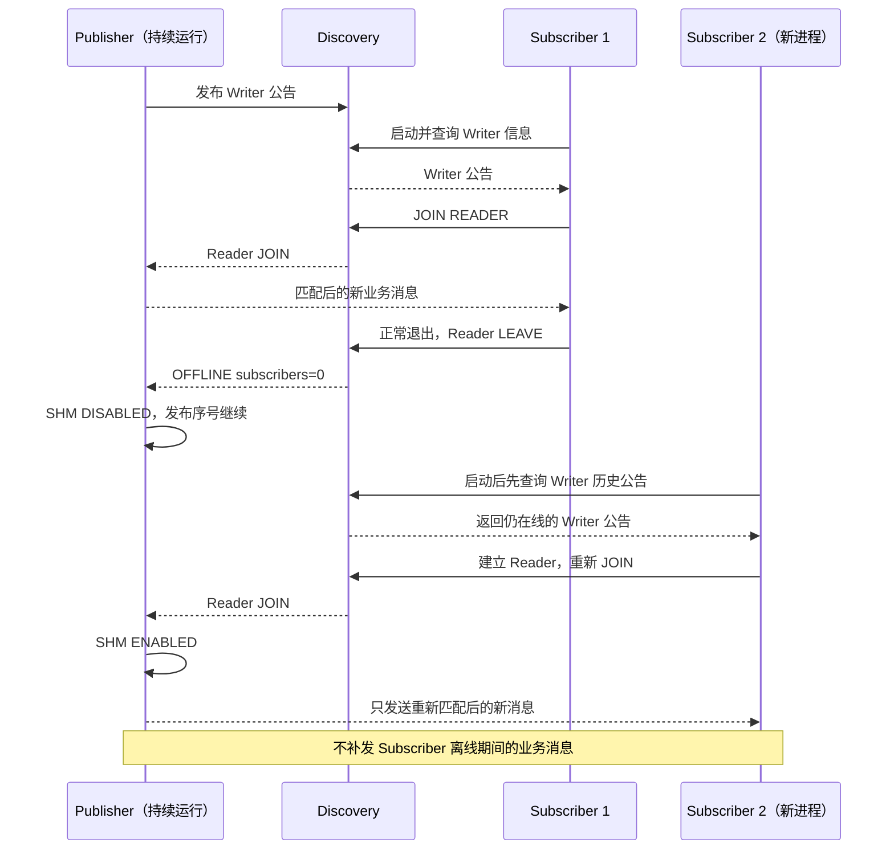

# MINI CyberRT 通信 Demo

这组 Demo 在本机展示自动选路、大消息 Loan/View 和订阅者退出恢复。实际验收记录见
[testlog](../testlog.md#2026-09-12-面试通信-demo-本地验收)。

## 1. 先跑一遍

从仓库根目录执行：

```bash
./example/demo/run_demo.sh
```

脚本构建后依次运行 A～E，检查结果并回收自己的子进程。每段默认观察 30 秒，D 包含两段。
每个场景都出现 `[RESULT] PASS scene=...`，最后出现 `[RESULT] PASS requested=all`，才算完整通过。

需要 Linux、g++、make、`unshare` 和 Fast DDS；先看 [依赖检查](../../doc/fastrtps.md)。
脚本自动设置 `CMW_PATH`，并让本轮进程共享一个独立 IPC namespace。宿主禁止 `unshare` 时会直接失败。

```bash
make -C example -f demo/Makefile -j2 demo-transport       # 只构建
FAST_DDS_HOME="$HOME/cpp/fastdds_2.12/install" \
  ./example/demo/run_demo.sh                              # 指定依赖目录
```

## 2. 单独运行与讲解顺序

| 场景 | 命令 | 展示重点 |
| --- | --- | --- |
| A | `./example/demo/run_demo.sh A` | 同进程；MATCHED、INTRA ENABLED、有效消息 |
| B | `./example/demo/run_demo.sh B` | 同机双进程；不同 PID、SHM ENABLED、有效接收 |
| C | `./example/demo/run_demo.sh C` | 1 MiB Loan；LOAN_SEND、只读 View、全内容校验 |
| D | `./example/demo/run_demo.sh D` | Publisher 不停；OFFLINE、DISABLED、重新 ENABLED、RECOVERED |
| E | `./example/demo/run_demo.sh E` | **同机强制 RTPS**；RTPS ENABLED、有效接收 |

A～D 使用 Node、Discovery 和默认 HYBRID；E 使用显式 Transport RTPS。常用参数：

```bash
./example/demo/run_demo.sh C --payload 4194304
./example/demo/run_demo.sh all --seconds 3 --no-build
./example/demo/build/bin/demo_transport --help
```

脚本的 `--seconds` 为 3～60 秒，`--payload` 只接受 1 MiB 或 4 MiB，`--no-build` 复用已有 Demo。
普通消息默认 1024 字节、10 Hz，Loan 默认 1 MiB、5 Hz。

## 3. 怎么看输出

| 输出 | 成功判据 |
| --- | --- |
| `[DISCOVERY] MATCHED / OFFLINE` | 订阅者集合出现 / 变为空 |
| `[ROUTE] ... ENABLED / DISABLED` | 对应发送后端启用 / 停用；启用本身不代表送达 |
| `[CHECK] FIRST_VALID / CONTIGUOUS_10` | 首条全内容正确 / 连续 10 条正确 |
| `[SUB] valid / invalid / gaps_online / order_errors` | 有效数；校验错误、在线缺口、重复或倒序 |
| `[RESULT] PASS / FAIL` | 进程或场景最终结果，需核对 `role`、`scene` 或 `requested` |

程序校验序号、长度和全部 Payload 字节。发送失败、内容错误、在线缺口或顺序错误都会失败。
普通 Publish 无订阅者时也可能返回 true，因此发送成功不等于接收成功；离线期间不计新订阅者缺口。

## 4. 双终端手动演示

先构建 Demo。终端一创建 IPC 环境并保持 shell：

```bash
unshare --user --map-root-user --ipc bash
echo "DEMO_SHELL_PID=$$"
```

终端二输入上述 PID，加入同一个环境：

```bash
read -r -p '输入终端一的 DEMO_SHELL_PID: ' DEMO_SHELL_PID
nsenter --target "$DEMO_SHELL_PID" --user --ipc --preserve-credentials bash
```

### 第一步：让两端共享同一 IPC 环境

不要让两个终端各自执行 `unshare`，否则通知区互不可见。两个新 shell 都进入仓库根目录并设置相同参数：

```bash
export CMW_PATH="$PWD" CMW_DEMO_TRACE=1
BIN="$PWD/example/demo/build/bin/demo_transport"
CHANNEL=interview_001; SCENE=D; PAYLOAD=1024; HZ=10
```

每次演示双方一起换新频道。先在终端二启动订阅者，再在 20 秒内从终端一启动发布者：

```bash
# 终端二
"$BIN" --role sub --scenario "$SCENE" --channel "$CHANNEL" \
  --payload "$PAYLOAD" --hz "$HZ" --seconds 30

# 终端一
"$BIN" --role pub --scenario "$SCENE" --channel "$CHANNEL" \
  --payload "$PAYLOAD" --hz "$HZ" --seconds 180
```

D 场景中，首个订阅者正常退出后等待 Publisher 显示 OFFLINE 和 SHM DISABLED，再运行一次订阅命令。
第二次出现 `CONTIGUOUS_10`，且新首序号大于上次末序号，表示恢复成功。最后在发布端按 Ctrl+C，并在两端 `exit`。

D 的关键顺序如下。第一个 Subscriber 必须正常退出；第二个 Subscriber 是新进程，先从 Discovery
获得仍在运行的 Writer 公告，再建立 Reader 并接收匹配后的新业务消息。Publisher 全程不重启，离线期间不补发。



切换场景时共同设置：B 为 `SCENE=B; PAYLOAD=1024; HZ=10`，C 为
`SCENE=C; PAYLOAD=1048576; HZ=5` 或 4 MiB，E 为 `SCENE=E; PAYLOAD=1024; HZ=10`。
A 只需单进程：`"$BIN" --role intra --scenario A --channel "$CHANNEL" --seconds 30`。

## 5. 实现要点与验证边界

- A～D 根据 IP/PID 选择 INTRA 或 SHM；多个不同位置的 peer 可同时启用多条路径。
- [trace.h](trace.h) 只注入 Demo 构建；`CMW_DEMO_TRACE=1` 输出实际后端状态变化。最终仍以有效接收为准。
- D 依靠 Discovery 的 Writer 历史公告让新进程恢复，只接收重新匹配后的新消息，不补发离线业务消息。
- E 只验证两个本机进程强制 RTPS，不是跨机器验证；正常退出恢复也不是 SIGKILL 恢复。
- 受控频率通过不代表极限吞吐、无损容量或硬实时保证。本 Demo 不输出性能提升倍数。

### Loan/View 到底省了哪次拷贝

[demo_transport.cpp](demo_transport.cpp) 的 Loan 发送先用 `AcquireMessage(payload)` 借出 SHM Block，
在 `mutable_data()` 中直接生成内容，设置长度后转移所有权。接收回调拿到只读 View，通过 `data()` 校验内容、
channel 和 generation，不把裸指针留到回调外。

纯 SHM Loan 省去普通消息的中间 Payload 序列化、复制入共享区和接收端 Payload 反序列化复制。
内容生成、全量校验、元数据和通知仍有成本；混合路径可能使用 heap 或复制。读 Lease 随最后一个消息引用释放，
运行库队列仍可能短暂持有引用。不要用跨进程指针地址证明零拷贝。

1 MiB/4 MiB 在当前 32 MiB 消息上限内，共享段约需 65 MiB/257 MiB。
[性能方法](../TESTING.md#性能程序) 与 [历史结果](../testlog.md#2026-09-11-独立进程-shm-性能实验) 另行记录。

现场展示建议按 A/B → C → D 讲自动选路、Loan 和恢复，E 只在需要说明网络后端时展开。
提前构建并做一次短时复验；保留一段成功运行的录屏和对应输出，避免现场环境问题中断讲解。

## 6. 失败排查与清理

脚本开头打印 `run_dir=...`。`example/demo/runs/本轮目录/` 保存构建输出、各角色输出、完整命令、PID、退出码，
并把本轮运行库 Logger 文件从根 `log/` 原样迁入。手动启动的 Logger 文件仍留在根 `log/`。
这是现有脚本的实际归档路径，尚待按 [AGENTS.md](../../AGENTS.md#日志文件归档) 迁入根目录 `log/`。

| 现象 | 检查 |
| --- | --- |
| 找不到 Fast DDS | 核对 `FAST_DDS_HOME`，运行 [依赖检查](../../doc/fastrtps.md) |
| `No space left on device` | 分别检查工作盘和 `/dev/shm` |
| `unshare: Operation not permitted` | 宿主不允许隔离；改用已确认兼容的 IPC 环境 |
| notifier 布局不兼容 | 确认两端位于同一新 IPC 环境，不删除陌生通知区 |
| 匹配、首条或恢复失败 | 核对频道、场景、Payload，并查看角色输出和 runtime 日志 |

构建最多 300 秒，匹配/首条最多 20 秒，离线最多 15 秒，正常退出最多 10 秒。
Ctrl+C 先请求本轮子进程正常退出，超时后才终止并判失败。脚本不批量杀进程、不清空 `/dev/shm`，
只报告本轮确切残留段；无法确认无人使用时不要删除。

Demo 产物保存在 `example/demo/build/`。重新构建前可在确认无进程使用后删除该目录；保留 `runs/` 便于排查。
Ctrl+C 回收检查可运行 `python3 example/demo/check_interrupt.py`。
